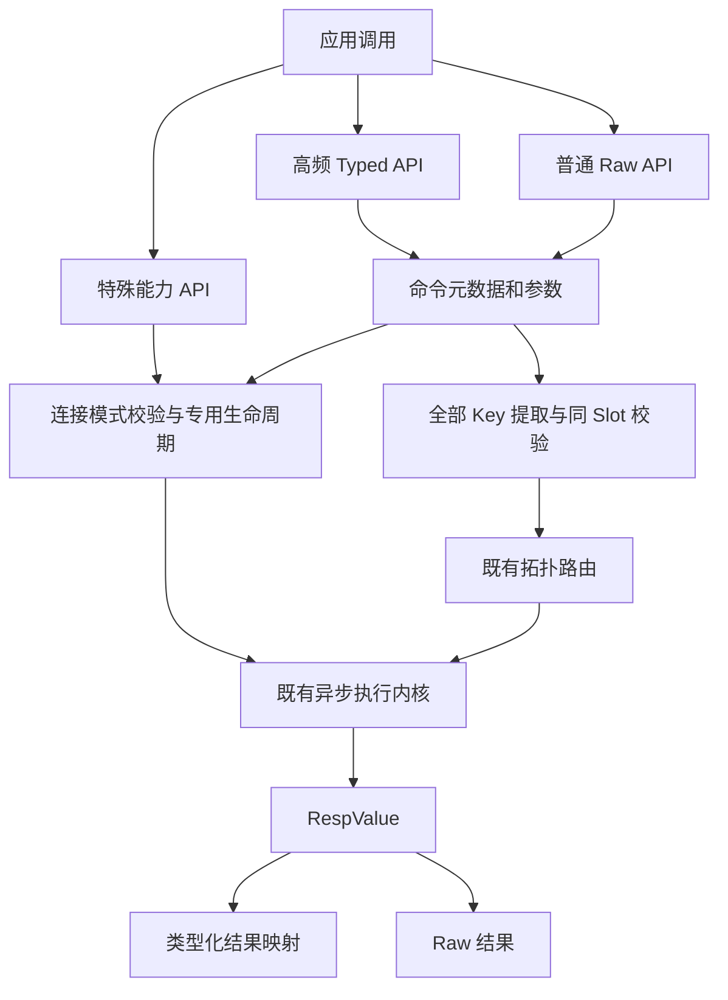

# C5 命令模型与 API 分层

决策日期：2026-09-28；实施基线 `fc8ce41`。
依据用户确认的《规划C5阶段》，将 C5 从“完整命令覆盖”调整为“高频 API 产品面与可维护扩展机制”。
聊天中的完成度判断不是验收证据：Cluster/Sentinel 仍限已验证的普通命令，C4 尚有待验证矩阵。

## 三层边界（C5.5）

| 层 | 面向用户的能力 | 边界 |
| --- | --- | --- |
| 高频 Typed API | Key/TTL/Counter/Bit、String、Hash、List、Set、ZSet | 同步 String、异步 String、异步 binary；返回 Long/Boolean 等语义类型，binary 不等于所有结果都用 byte[] |
| 特殊能力 API | Transaction、Blocking、Pipeline、Pub/Sub、Scan | 事务/阻塞/订阅管理专用连接；Pipeline 批量保序不原子；Scan 逐页游标不承诺一致性快照 |
| Raw 普通命令出口 | 新版、低频、未包装普通命令 | 返回 RespValue；仍受连接安全、准入、错误/取消与路由约束，不是绕过安全规则的后门 |

未知普通 Raw 命令在 Standalone/Sentinel 保留出口；调用方负责核对其不会改变连接状态、阻塞或切换协议。
客户端无法在离线注册表中识别未来/模块命令的全部副作用；未知不意味着自动证明安全。
Cluster 未知命令必须显式声明全部 Key；已知命令不能通过显式声明绕过同 Slot 检查。
任何形式都不根据 read-only、幂等等元数据自动重试，超时/取消不代表服务端撤销。

## 命令元数据（C5.4）

内部模型不作为用户自定义插件 SPI 发布，先保持包内可演进：

- `CommandSpec`：命令名、Key 提取规则、连接模式、读写属性；版本信息仅在已核实处记录。
- `CommandArgs`：String/binary 参数访问，命令名与控制参数使用 ASCII；二进制 Key 不经 UTF-8 往返。
- `CommandDecoder<T>`：RESP2/RESP3 到结果模型，沿用统一 RespValue；服务端错误由执行内核处理。
- `TypedCommand<T>`：不可变普通 String 调用，绑定命令名、参数快照与 decoder；复用注册表准入规则。
- `CommandExecutor`：拓扑无关的异步普通执行入口；结果通过 BobaStrawStages.map 映射并传播取消，
  不自行建连接、排队或重试。Standalone/Cluster/Sentinel 由各自既有 executeAsync 适配。
- `CommandRegistry`：单一元数据表和共享入口策略，Cluster 路由、Standalone/Sentinel Raw、Pipeline/事务校验消费它。
- `ClusterCommandRouting`：消费 Key 规则计算同 Slot，保留拓扑和重定向的原有职责。

元数据按“命令形式”逐步完善，不能仅靠命令名猜测可变 Key、BLOCK/STORE 等选项。
暂未实现选项感知元数据的 XREAD/XREADGROUP 保守拒绝普通入口；复杂未知命令走显式 Key Raw。
版本是语义文档而非自动探测或降级开关；HELLO 3/AUTO 回退策略不变。
注册表不承担解析响应、排队、建连接或调度，不创建另一套执行引擎。

图沿用 Mermaid 11.16.0 基线。元数据复用不能改变 FIFO、Push/Attribute、callback 隔离或失败分类。
同步 facade 继续等待 transport completion，不能改成等待 callback worker，以免重新引入饥饿。

## 高频范围与退出标准

冻结第一轮范围，不随 Redis 官网命令数增长：

| 分组 | 第一轮重点 |
| --- | --- |
| Key/TTL | EXISTS、DEL、UNLINK、TYPE、EXPIRE/PEXPIRE、EXPIREAT/PEXPIREAT、TTL/PTTL、PERSIST |
| String/Counter/Bit | 已有 GET/SET/MGET/MSET/MSETNX 与范围操作；INCR/INCRBY/DECR/DECRBY、GETBIT/SETBIT/BITCOUNT |
| Hash | HGET/HSET/HMGET/HGETALL/HDEL/HEXISTS/HLEN/HINCRBY |
| List | LPUSH/RPUSH/LPOP/RPOP/LRANGE/LLEN；BLPOP/BRPOP 继续专用连接 |
| Set | SADD/SREM/SMEMBERS/SCARD/SISMEMBER；集合间运算暂留 Raw 同 Slot 策略 |
| ZSet | ZADD/ZREM/ZRANGE/ZSCORE/ZCARD/ZRANK；复杂聚合/新版选项暂留 Raw |
| Scan | 后续逐页结果对象与 SCAN/HSCAN/SSCAN/ZSCAN，不隐式遍历全库 |

Binary Hash 不使用 Map<byte[], byte[]> 冒充按内容相等的 Map；字段结果采用有序键值条目。
Binary Set 同理保留字节列表，不宣称 Java 数组按内容去重。ZSet 分值使用可空 Double，排名可空 Long。
所有新增 typed 接口都要验证 key/value 非 UTF-8、Null/空聚合、错误及版本边界。

C5 退出须同时满足：上述高频范围与明确例外有覆盖表；元数据在真实执行路径被消费；
三层入口有机械测试；扩展指南与用法一致；Java 8 与真实 RESP2/AUTO 矩阵通过。
不是注册了命令名就算 typed 已实现，也不是生成了测试壳就算语义验收。
冷门管理命令、模块命令、全选项、Stream/Geo/HLL 的完整 typed 套件不作为 C5 阻塞项。

## 实施顺序与演进记录

1. 保留已完成 C5.1；先抽取 C5.4 注册表并落地 C5.5 的入口限制，消除多份状态命令名单。
2. 用共享模型完成 C5.2；再按 Hash/List/Set/ZSet 分批完成 C5.3。
3. 收口 typed decoder 与 Scan 等特殊结果模型；补注册表契约测试与扩展指南，完成 C5 退出验收。
4. C6 继续拓扑与专用能力组合；TLS/Starter 的后续阶段编号沿用核心计划，不凭聊天重新宣称完成。

本次重新定义编号：旧覆盖清单的“C5.4 Scan/Stream/Geo/HLL/Lua”和“C5.5 更多阻塞”不再作为同名阶段。
历史 C5.1 报告保留；新编号分别表示“命令元数据化”与“三层 API 边界”。
实施与测试结果在 [命令覆盖](../implementation/command-coverage.md) 单独登记。

### Typed 执行复用第一批（2026-09-28）

Standalone、Cluster、Sentinel 的 `async()` 复用同一 BobaStrawAsyncCommands：普通 String
类型化方法统一创建 TypedCommand，再交给 CommandExecutor。EVAL 仍返回 RespValue，
不猜测脚本结果类型。原有 String 同步接口与 binary 接口保持原路径，本批未统一它们。

Cluster 的多 Key 同 Slot、MOVED/ASK 和 Sentinel 发现/切换均由既有拓扑执行负责，
不因为引入 typed 层而放宽；取消传回原拓扑 Future。无 Key 命令只访问一个 Cluster 主节点，
KEYS/RANDOMKEY 不是全集群视图。BLPOP/BRPOP 在该公共 facade 上仅 Standalone 可用，
Cluster/Sentinel 调用时同步抛 UnsupportedOperationException，发送前拒绝。

该抽象当前仅面向普通 text 命令，不用它直接执行 MULTI/EXEC 或订阅。
下一批：设计 Pipeline/事务异构结果句柄（保留原 List<RespValue> API）、独立批量生命周期，
再补 Scan 页结果；binary/sync 的统一与拓扑 binary 支持需分别验证，不能由本批推断已实现。
