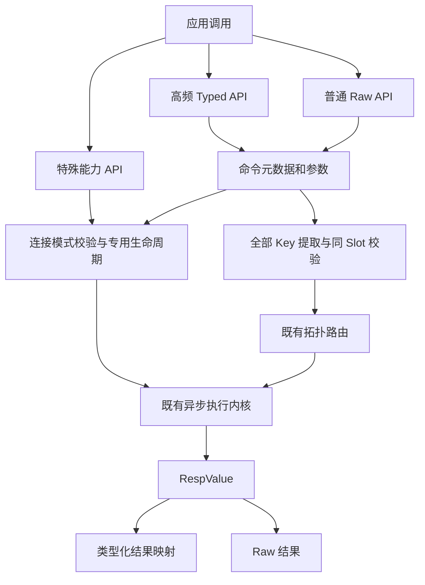

# C5 命令模型与 API 分层

决策日期：2026-09-28；实施基线 `fc8ce41`。
依据用户确认的《规划C5阶段》，将 C5 从“完整命令覆盖”调整为“高频 API 产品面与可维护扩展机制”。
聊天中的完成度判断不是验收证据：Cluster/Sentinel 仍限已验证的普通命令，C4 尚有待验证矩阵。

## 三层边界（C5.5）

| 层 | 面向用户的能力 | 边界 |
| --- | --- | --- |
| 高频 Typed API | Key/TTL/Counter/Bit、String、Hash、List、Set、ZSet | 同步 String、异步 String、异步 binary；返回 Long/Boolean 等语义类型，binary 不等于所有结果都用 byte[] |
| 特殊能力 API | Transaction、Blocking、Pipeline、Pub/Sub、Scan | 事务/阻塞/订阅管理专用连接；Pipeline 批量保序不原子；Scan 逐页游标不承诺一致性快照 |
| Raw 普通命令出口 | 新版、低频、未包装普通命令 | 返回 RespValue；仍受连接安全、准入、错误/取消与路由约束，不是绕过安全规则的后门 |

未知普通 Raw 命令在 Standalone/Sentinel 保留出口；调用方负责核对其不会改变连接状态、阻塞或切换协议。
客户端无法在离线注册表中识别未来/模块命令的全部副作用；未知不意味着自动证明安全。
Cluster 未知命令必须显式声明全部 Key；已知命令不能通过显式声明绕过同 Slot 检查。
任何形式都不根据 read-only、幂等等元数据自动重试，超时/取消不代表服务端撤销。

## 命令元数据（C5.4）

内部模型不作为用户自定义插件 SPI 发布，先保持包内可演进：

- `CommandSpec`：命令名、Key 提取规则、连接模式、读写属性；版本信息仅在已核实处记录。
- `CommandArgs`：String/binary 参数访问，命令名与控制参数使用 ASCII；二进制 Key 不经 UTF-8 往返。
- `CommandDecoder<T>`：RESP2/RESP3 到结果模型，沿用统一 RespValue；服务端错误由执行内核处理。
- `TypedCommand<T>`：不可变普通 String/binary 调用，绑定命令名、参数快照与 decoder；复用注册表准入规则。
- `CommandExecutor`：拓扑无关的异步普通执行入口；结果通过 BobaStrawStages.map 映射并传播取消，
  不自行建连接、排队或重试。Standalone/Cluster/Sentinel 由各自既有 executeAsync 适配。
- `BinaryCommandExecutor`：原始字节执行适配，仅编码 ASCII 命令名；当前只接入 Standalone，
  不因存在适配接口而宣称支持拓扑 binary。同步 facade 消费同一 TypedCommand，但仍直接等待 transport。
- `CommandRegistry`：单一元数据表和共享入口策略，Cluster 路由、Standalone/Sentinel Raw、Pipeline/事务校验消费它。
- `ClusterCommandRouting`：消费 Key 规则计算同 Slot，保留拓扑和重定向的原有职责。

元数据按“命令形式”逐步完善，不能仅靠命令名猜测可变 Key、BLOCK/STORE 等选项。
暂未实现选项感知元数据的 XREAD/XREADGROUP 保守拒绝普通入口；复杂未知命令走显式 Key Raw。
版本是语义文档而非自动探测或降级开关；HELLO 3/AUTO 回退策略不变。
注册表不承担解析响应、排队、建连接或调度，不创建另一套执行引擎。



图沿用 Mermaid 11.16.0 基线。元数据复用不能改变 FIFO、Push/Attribute、callback 隔离或失败分类。
同步 facade 继续等待 transport completion，不能改成等待 callback worker，以免重新引入饥饿。

## 高频范围与退出标准

冻结第一轮范围，不随 Redis 官网命令数增长：

| 分组 | 第一轮重点 |
| --- | --- |
| Key/TTL | EXISTS、DEL、UNLINK、TYPE、EXPIRE/PEXPIRE、EXPIREAT/PEXPIREAT、TTL/PTTL、PERSIST |
| String/Counter/Bit | 已有 GET/SET/MGET/MSET/MSETNX 与范围操作；INCR/INCRBY/DECR/DECRBY、GETBIT/SETBIT/BITCOUNT |
| Hash | HGET/HSET/HMGET/HGETALL/HDEL/HEXISTS/HLEN/HINCRBY |
| List | LPUSH/RPUSH/LPOP/RPOP/LRANGE/LLEN；BLPOP/BRPOP 继续专用连接 |
| Set | SADD/SREM/SMEMBERS/SCARD/SISMEMBER；集合间运算暂留 Raw 同 Slot 策略 |
| ZSet | ZADD/ZREM/ZRANGE/ZSCORE/ZCARD/ZRANK；复杂聚合/新版选项暂留 Raw |
| Scan | String 异步逐页 SCAN/HSCAN/SSCAN/ZSCAN，不隐式遍历全库；Cluster 仅单 Key 扫描 |

Binary Hash 不使用 Map<byte[], byte[]> 冒充按内容相等的 Map；字段结果采用有序键值条目。
Binary Set 同理保留字节列表，不宣称 Java 数组按内容去重。ZSet 分值使用可空 Double，排名可空 Long。
所有新增 typed 接口都要验证 key/value 非 UTF-8、Null/空聚合、错误及版本边界。

C5 退出须同时满足：上述高频范围与明确例外有覆盖表；元数据在真实执行路径被消费；
三层入口有机械测试；扩展指南与用法一致；Java 8 与真实 RESP2/AUTO 矩阵通过。
不是注册了命令名就算 typed 已实现，也不是生成了测试壳就算语义验收。
冷门管理命令、模块命令、全选项、Stream/Geo/HLL 的完整 typed 套件不作为 C5 阻塞项。

## 实施顺序与演进记录

1. 保留已完成 C5.1；先抽取 C5.4 注册表并落地 C5.5 的入口限制，消除多份状态命令名单。
2. 用共享模型完成 C5.2；再按 Hash/List/Set/ZSet 分批完成 C5.3。
3. 收口 typed decoder 与 Scan 等特殊结果模型；补注册表契约测试与扩展指南，完成 C5 退出验收。
4. C6 继续拓扑与专用能力组合；TLS/Starter 的后续阶段编号沿用核心计划，不凭聊天重新宣称完成。

本次重新定义编号：旧覆盖清单的“C5.4 Scan/Stream/Geo/HLL/Lua”和“C5.5 更多阻塞”不再作为同名阶段。
历史 C5.1 报告保留；新编号分别表示“命令元数据化”与“三层 API 边界”。
实施与测试结果在 [命令覆盖](../implementation/command-coverage.md) 单独登记。

### Typed 执行复用第一批（2026-09-28）

Standalone、Cluster、Sentinel 的 `async()` 复用同一 BobaStrawAsyncCommands：普通 String
类型化方法统一创建 TypedCommand，再交给 CommandExecutor。EVAL 仍返回 RespValue，
不猜测脚本结果类型。原有 String 同步接口与 binary 接口保持原路径，本批未统一它们。

Cluster 的多 Key 同 Slot、MOVED/ASK 和 Sentinel 发现/切换均由既有拓扑执行负责，
不因为引入 typed 层而放宽；取消传回原拓扑 Future。无 Key 命令只访问一个 Cluster 主节点，
KEYS/RANDOMKEY 不是全集群视图。BLPOP/BRPOP 在该公共 facade 上仅 Standalone 可用，
Cluster/Sentinel 调用时同步抛 UnsupportedOperationException，发送前拒绝。

该抽象当前仅面向普通 text 命令，不用它直接执行 MULTI/EXEC 或订阅。
下一批：设计 Pipeline/事务异构结果句柄（保留原 List<RespValue> API）、独立批量生命周期，
再补 Scan 页结果；binary/sync 的统一与拓扑 binary 支持需分别验证，不能由本批推断已实现。

### Pipeline / 事务 typed 结果（2026-09-28，第二批）

新增 BobaStrawBatchCommands（本地入队）、BobaStrawCommandHandle<T>（批次身份、位置、decoder）
和 BobaStrawBatchResult（有序回复、WATCH abort 标记）。Pipeline 与事务共用 typed() 命令目录，
内部复用 TypedCommand<T> 与既有 decoder，但不经普通 CommandExecutor 逐条发送。
事务仍控制专用租约上的 MULTI/QUEUED/EXEC；Pipeline 仍使用批量准入和聚合写入。

句柄不是 Future，不支持单条取消；必须执行 executeTyped()/execTyped() 后通过 get(handle) 取值。
解码发生在 get 的调用线程，不占 EventLoop，也不创建未执行但待完成的 Future。
不同批次的句柄拒绝读取，Raw 与 typed 命令可以混排，位置以同一队列为准。

| 结果 | 新 typed 批量接口 | 原 Raw 接口 |
| --- | --- | --- |
| 全部普通回复 | 按句柄返回各自类型 | List<RespValue> 不变 |
| 单条服务端错误 | get(对应句柄) 抛 BobaStrawServerException，其他位置可读 | Pipeline execute 整批异常；事务 exec 数组内保留错误 |
| 网络失败、超时、容量拒绝 | 整批 Stage 异常，不伪装为单条服务端错误 | 保留原行为 |
| WATCH 冲突 | isAborted 为 true，get 拒绝读取 | exec 仍返回空列表 |
| 成功的空事务 | isAborted 为 false，回复为空 | exec 返回空列表 |

Pipeline retain-errors 模式只将显式 BobaStrawServerException 转成 RESP Error，保留消息，
不保留 RESP3 BlobError 的 wire 类型；连接/超时异常不会转为成功。Raw execute 使用旧模式。
事务 EXEC 数组里的错误保持原 RESP 类型。结果只快照列表结构，replies() 不深复制 RESP payload。

取消 executeTyped 的 Stage 向原批量请求传播，已发送响应仍排空；取消 execTyped 使用原
Operation.abort 销毁租约。没有自动重试、逐条跳过、失败回滚或隐式跨 Slot 拆分。
本批只提供 Standalone String 批量目录，暂不提供 binary 或 Cluster/Sentinel 的批量组合。
初始 16 个高频方法与测试记录见覆盖清单；Scan 页结果和 binary/sync 统一仍待实现。

```java
BobaStrawPipeline batch = client.pipeline();
BobaStrawCommandHandle<String> value = batch.typed().get("key");
BobaStrawCommandHandle<Long> ttl = batch.typed().ttl("key");
BobaStrawBatchResult result = batch.executeTyped().toCompletableFuture().get();
String text = result.get(value);
Long seconds = result.get(ttl);

try (BobaStrawTransaction tx = client.transaction()) {
    BobaStrawCommandHandle<Long> count = tx.typed().incr("counter");
    BobaStrawBatchResult committed = tx.execTyped().toCompletableFuture().get();
    if (!committed.isAborted()) {
        Long current = committed.get(count);
    }
}
```

语义核实：[Redis transactions](https://redis.io/docs/latest/develop/using-commands/transactions/)、
[Redis pipelining](https://redis.io/docs/latest/develop/using-commands/pipelining/)，2026-09-28。
EXEC 执行期单条错误不阻止其他命令，Redis 不回滚；Pipeline 是减少往返，不提供事务隔离。

### Scan typed 分页（2026-09-28，第三批）

三种 Client 新增 `scan()`，返回特殊能力入口 BobaStrawScanCommands；它仍复用共享连接和
TypedCommand/CommandExecutor，不创建专用连接、全库缓存或后台遍历任务。
每次 scan/hscan/sscan/zscan 请求返回一个 CompletionStage<ScanPage<T>>，取消传播到该页请求。

- ScanArgs 不可变，支持 MATCH 与正数 COUNT；没有 TYPE、NOVALUES 等新版选项。
- ScanPage 提供 cursor()/values()/isFinished()；游标用字符串承载 unsigned 64-bit，不按 long 截断。
- SCAN/SSCAN 返回 String；HSCAN 返回 List 中的不可变 field/value Entry；ZSCAN 返回 member/Double Entry。
  页列表只读，保留重复与空字符串，不自行去重。空页不等于结束，COUNT 不保证返回数量。
- Standalone/Sentinel 支持四种扫描；Cluster 仅 HSCAN/SSCAN/ZSCAN 按 Key 路由。
  无节点绑定的 Cluster scan().scan(...) 本地拒绝，不能把一次随机主节点 SCAN 包装成全库遍历。
- 分页间 Sentinel 切换或 Cluster 迁移不提供游标连续性保证；调用方应结合业务容错处理，客户端不自动重启扫描。
- 本批仅异步 String，不提供 binary、同步专用 facade、自动 iterator/stream 或批量 Scan 包装。

```java
String cursor = "0";
do {
    ScanPage<String> page = client.scan()
        .sscan("members", cursor, ScanArgs.none().count(100))
        .toCompletableFuture().get();
    for (String member : page.values()) {
        // Process members; repeated values are possible.
    }
    if (page.isFinished()) {
        break;
    }
    cursor = page.cursor();
} while (true);
```

SCAN 系列和 MATCH/COUNT 适用 Redis 5 基线（命令自 2.8 起）；原协议协商与不重试策略不变。
语义来源：[SCAN](https://redis.io/docs/latest/commands/scan/)、
[HSCAN](https://redis.io/docs/latest/commands/hscan/)、[ZSCAN](https://redis.io/docs/latest/commands/zscan/)，
核实日期 2026-09-28。SCAN 官方总述同时说明 SSCAN 的游标、成员返回与 COUNT 语义。

### Binary / sync typed 收口（2026-09-28，第四批）

在前三批基础上，Standalone 的全部既有 binary 普通方法统一使用 TypedCommand.binary、
BinaryCommandExecutor 和共享 CommandDecoders。命令名保持 ASCII，Key/value 保留原始字节；
调用对象深复制两层参数数组，读取参数也返回深复制，避免调用方或适配器修改对象内部状态。
text/binary 执行器误配在发送前拒绝，不做隐式转码。

String 同步普通方法也构造 TypedCommand，沿用 client.executeTransport + await，
随后在等待的调用线程解码；不改成 async().get()，不在 EventLoop 上映射结果，
因此 callback worker 被业务 continuation 占住时，同步调用仍可完成。
BLPOP/BRPOP 继续专用生命周期；EVAL 仍返回 RespValue，不伪造脚本结果类型。

本批没有新增公共方法或扩大拓扑范围。Binary GET/SET/DEL 的 null 参数、空 DEL 现在与其他
binary 方法一致地本地抛 IllegalArgumentException；合法空字节 key/value 仍允许。
既有 GET/SET/MGET 等改用共享 decoder，畸形非字符串响应不会被有损转换成字节成功值。
输入深快照和执行器防御副本增加 payload 复制，尚未做本版 binary 大 value JMH，
不能引用旧版本约 1x payload copy 的测量作为本版性能结论。

仍不包含 Cluster/Sentinel binary/sync facade、binary Scan/batch；这些不由内部收口自动获得。
C5 最终退出审查与历史非法 H 根因追踪继续保留，不能把本批测试通过等同问题已修复。

### Binary 帧所有权优化（2026-09-28，第五批）

第四批的两层参数快照与执行器防御副本是历史实现。现在 binary TypedCommand 先执行同一
CommandRegistry 准入校验，再调用既有 RESP encoder 一次生成 EncodedCommand；不再保留两份
原始参数。EncodedCommand 是 internal 包的不可变传输对象，构造时立即编码，底层数组私有，
仅提供只读 ByteBuffer，且每次获取有独立 position/limit。调用方返回后修改原始数组不影响 wire。
调用期间仍不得从其他线程并发修改传入参数。

BinaryCommandExecutor 接收该帧而非复制后的 byte[][]；Client 包内入口直接交给 NioConnection，
复用既有 callback/connection capacity、请求 deadline、取消 drain 与 FIFO，既不二次编码也不绕过准入。
普通 Raw binary 路径不变。EncodedCommand 自身不是普通命令授权器，不能用于业务绕过 Client；
public 可见性只用于 core 的父包与 internal 子包协作，不作为稳定扩展 SPI。

这是应用参数到库内 wire 帧的一次 payload 复制，不是“零拷贝”：JDK/socket/OS/服务端仍可能复制。
本轮性能证据与功能退出核对见 [C5 收尾审查](../implementation/c5-exit-review.md)。
