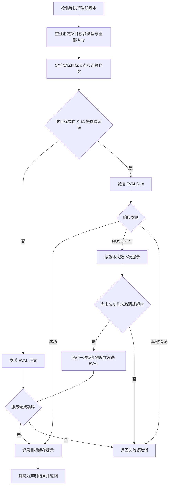
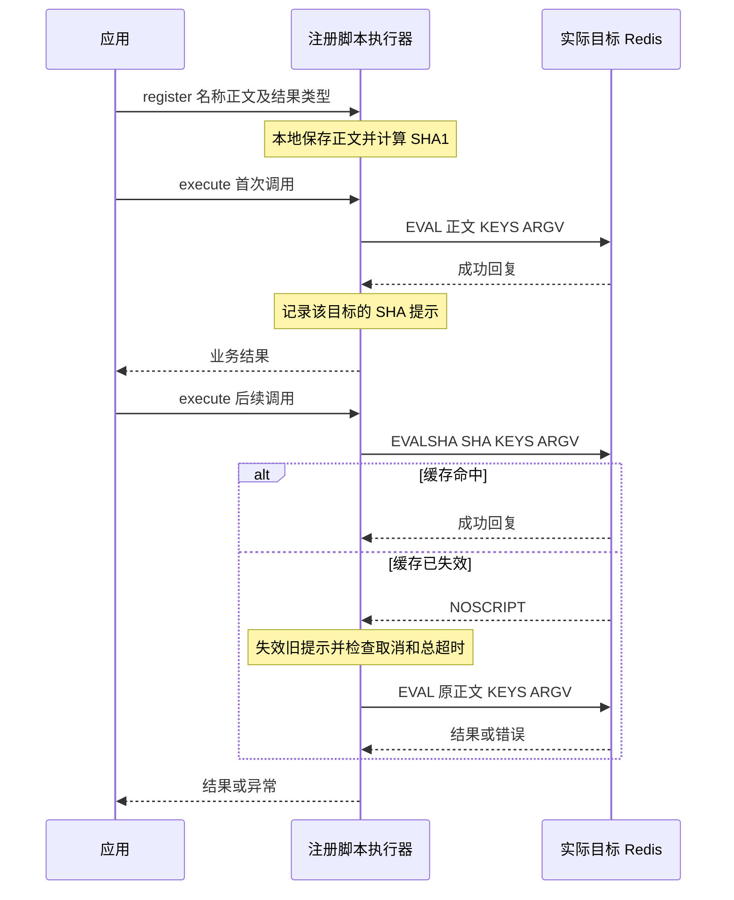

# Lua 脚本设计：让业务调用脚本，不管理脚本缓存

当前 L1/L2 已实现，L3/L4 待实施。阶段状态见[实施进度](../implementation/lua-scripting-progress.md)，验证边界见[测试记录](../testing/lua-scripting-validation.md)，接入示例见[使用指南](../usage/lua.md)。

## 1. 我们要解决什么问题

Lua 常用于扣减库存、条件更新等需要在 Redis 内完成判断和修改的操作。
业务真正关心的是“执行这段逻辑并得到结果”，而不是脚本正文传了几次、SHA 是否加载、当前节点有没有缓存。

直接使用 Redis 命令时，业务会面临两种负担：

- 始终 EVAL：调用简单，但每次重复传输同一份正文。
- 使用 EVALSHA：后续只传摘要，但必须处理脚本加载、缓存丢失和多节点差异。

如果这些管理逻辑散落在业务代码里，容易出现全局“已加载”标记、先检查再执行的竞态，
甚至把超时当成缓存缺失重新执行。对会修改数据的脚本，最后一种错误可能造成重复扣减。

因此，本方案的核心目标是：

> 让业务像调用一个已命名的方法一样执行 Redis Lua 脚本，无需管理正文、SHA 和服务端缓存；
> 同时不掩盖脚本可能已经执行的失败。

落实到使用方式，就是把脚本定义与业务调用分开：应用初始化时注册一次，业务按名称传入 Key 和参数，并声明结果类型。
以计数器递增为例，假设已有一个长期复用的 client：

```java
// 应用初始化：本地注册一次，不访问 Redis、不执行业务。
client.scripts().register("increment-v1",
    "return redis.call('INCRBY', KEYS[1], ARGV[1])", ScriptOutput.integer());

// 业务调用：传入 Key 和参数，获得明确类型的异步结果。
CompletionStage<Long> result = client.scripts().execute(
    "increment-v1", ScriptOutput.integer(), new String[] {"{order}:counter"}, "1");
```

业务不需要额外保存脚本句柄、计算 SHA 或先调用 SCRIPT LOAD。客户端负责选择 EVAL/EVALSHA，
并在满足安全契约时处理一次明确的 NOSCRIPT 缓存恢复；超时、断连等不确定失败仍交给业务，不自动重复执行。
这将缓存管理收进客户端，但不把执行风险隐藏起来。具体安全契约在第 4 节展开。

### 目标与非目标

围绕上述调用体验，方案需要同时满足以下目标：

| 目标 | 设计选择 |
| --- | --- |
| 业务调用简单、定义一致 | 本地注册一次，按名称执行；同名冲突拒绝 |
| 减少重复正文传输，不增加首次加载往返 | 未知目标缓存时 EVAL，有成功提示后 EVALSHA |
| 应对缓存失效和目标节点变化 | 目标感知提示 + 一次明确 NOSCRIPT 恢复 |
| 保持写操作失败语义 | 超时、断连、运行错误不自动重放 |
| 保持客户端轻量、有界 | Java 8/JDK-only，复用 NIO 内核，注册表和提示分别限额 |

不负责执行客户端 Lua、分析脚本是否幂等、保证脚本永久驻留、自动广播预热或管理集群扩缩容。
不提供“恰好执行一次”、失败回滚、断网期间无感续跑的承诺；Redis Functions、读写分离也不在范围内。
约束继承[命令模型](command-model.md)和[架构决策](decisions.md)。

## 2. 为什么选择“首次 EVAL，后续 EVALSHA”

### 候选方案与取舍

下表比较单个目标上的脚本请求，不计连接握手、路由发现和重定向；往返数不是性能压测结论。

| 方案 | 首次或缓存未知时 | 缓存命中后 | 代价与选择 |
| --- | --- | --- | --- |
| 始终 EVAL | 1 次 | 1 次，每次带正文 | 最简单，但放弃减少正文传输；保留为直接 API |
| 首次 SCRIPT LOAD，再 EVALSHA | 2 次 | 1 次 | 加载与执行分离；适合显式预热，不作为默认路径 |
| 始终 EVALSHA，NOSCRIPT 后 LOAD + EVALSHA | 命中 1 次，缺失 3 次 | 1 次 | 不需要本地命中提示，但冷目标额外往返较多 |
| 未知时 EVAL，命中提示后 EVALSHA；NOSCRIPT 后 EVAL | 1 次 | 1 次；提示过时则共 2 次 | 采用；需要维护少量可能过时的提示 |

本地已经保存正文，就不必为取得 SHA 额外访问服务器：对精确正文用 JDK 计算 SHA-1 即可。
EVAL 同时完成执行和服务端缓存建立；EVALSHA 缺失时直接 EVAL，也不需要先 LOAD 再执行。
命令语义见 [EVAL](https://redis.io/docs/latest/commands/eval/)、
[EVALSHA](https://redis.io/docs/latest/commands/evalsha/) 和 [SCRIPT LOAD](https://redis.io/docs/latest/commands/script-load/)。

接受的代价是：即使服务端已经有脚本，只要本地没有可信目标提示，仍会传一次正文。
提示淘汰、重连或首次并发也可能多传正文。我们用这点带宽开销换取保守、容易恢复的状态管理，
不追求与服务器缓存保持强一致。

## 3. 三种信息，三个不同职责

### 本地定义：业务调用的稳定依据

每个 Client 保存名称、正文原始字节、本地 SHA 和结果描述。注册是本地操作，不访问 Redis。

- 名称用于业务识别；SHA 用于服务端寻址。相同正文可以使用不同业务名称。
- 同名、相同正文、相同结果描述的重复注册幂等；任一不同则拒绝。
  这是为了避免多个模块或并发初始化悄悄改写同一名称的含义。更新使用新名称/版本，不热覆盖。
- 正文不可变，不做 trim、换行替换或隐式脚本注入；String 按 UTF-8 编码，byte[] 保持原字节。
- 定义超限时明确拒绝，不静默淘汰。否则原本有效的业务名称会因缓存策略突然不可用。
- 调用只传 KEYS/ARGV 等业务参数，不按每次请求动态生成新正文。

### 目标提示：可以丢失、允许过时的优化信息

提示表示“这条实际目标连接曾成功执行过这个 SHA”，不表示“服务器现在一定拥有脚本”。

提示按 Client 作用域、实际节点/物理连接代次和 SHA 隔离，而不是全局 SHA 布尔值。
相同 host:port 重建连接也不继承提示；节点切换不能复用原节点的经验。
代价是连接变动后可能多传一次正文，收益是无需探测服务器缓存全貌。

提示只有一个职责：决定本次先发 EVAL 还是 EVALSHA。正确性不能依赖提示永远准确：

- 服务端成功后先记录提示，再解码业务结果；Null/空值也是成功，解码失败不能导致重发。
- 旧连接的迟到成功不能为当前连接建立提示。
- NOSCRIPT 按本次观察到的 token/version 失效，避免旧失败误删后来建立的提示。
- 提示有界且可淘汰；丢失只影响下一次请求的正文传输。失效条目可惰性清理，不能被新代次使用。
- 不每次 SCRIPT EXISTS：它多一次请求，而且检查之后仍可能失效，不能取代 NOSCRIPT 处理。

首次并发调用各自 EVAL，不合并业务执行，不等待另一笔业务调用“完成加载”，不共享业务结果。
Client 关闭时释放定义、提示和在途操作；不建立全局无界缓存或额外线程模型。

### 服务端缓存：不归客户端控制

脚本缓存可能因重启、主节点切换、SCRIPT FLUSH 或脚本淘汰而丢失。
Redis 7.4 起通过 EVAL 引入的脚本存在 LRU 淘汰行为；不能把它与数据 Key 的过期/淘汰混为一谈，
也不能将 EVAL、SCRIPT LOAD 或不同 Valkey 版本的缓存策略视为相同。
依据：[EVAL 缓存说明](https://redis.io/docs/latest/commands/eval/)、
[脚本缓存](https://redis.io/docs/latest/develop/programmability/eval-intro/)。

因此不尝试维护缓存镜像，也不在重连时把全部脚本重新加载到全部节点。
只有业务实际访问到目标时才执行所需脚本，避免节点数 × 脚本数的预热工作。

## 4. 安全底线决定 NOSCRIPT 的处理方式

NOSCRIPT 恢复不是通用重试机制。业务显式选择注册执行器，才启用这个有界例外：

1. 本次发送的是 EVALSHA。
2. 收到顶层、精确的 NOSCRIPT 错误码，而不是消息中包含该字符串或嵌套结果中的错误。
3. 整次逻辑操作尚未使用恢复额度，并且尚未取消、总 deadline 尚未到期。
4. 失效观察到的旧提示，最多补一次 EVAL；EVAL 自身再失败就结束，不递归恢复。

这里有一个必须由脚本作者遵守的前提：**脚本及其调用的扩展不得伪造或转发 NOSCRIPT 为顶层业务错误。**
否则脚本可能先修改数据再返回同名错误，客户端无法仅靠错误码证明它没有执行。
注册表不静态分析 Lua 来假装证明安全；不满足这个契约时必须使用直接 EVAL/evalSha。

| 结果 | 是否恢复 | 理由 |
| --- | --- | --- |
| EVALSHA 明确 NOSCRIPT，且满足上述契约 | 最多一次 EVAL | 恢复缺失的脚本正文，不是重放不确定的执行 |
| 超时、连接中断 | 否 | 脚本可能已执行，只是结果没收到 |
| BUSY、权限错误、脚本运行错误 | 否 | 不是缓存缺失；运行错误还可能发生在写入之后 |
| 结果类型解码失败 | 否 | 服务端可能已成功执行，客户端转换失败不是重发依据 |
| 初次或恢复 EVAL 返回 NOSCRIPT | 否 | 不能再次解释成 EVALSHA 的缓存缺失 |

恢复和 MOVED/ASK 共用整次调用的总超时与取消状态，不给每个子请求重新计时。
取消生效后不再提交后续请求；已写请求继续排空回复，避免污染 FIFO，不自动 SCRIPT KILL。
恢复 EVAL 的最终失败按它自身的写入状态分类；此前的 NOSCRIPT 不意味着后续失败可以安全重试。
ASKING 阶段失败且脚本尚未提交时，应保留“业务脚本未发送”的语义。

### 执行决策流程

图使用 Mermaid 11.16.0。此图聚焦选定目标上的脚本决策；有界重定向见下一节。
每次发送前都检查同一 deadline 和取消状态，错误分类按上表处理。



### 为什么能减少冷启动往返



首次 EVAL 一次往返，缓存命中 EVALSHA 一次；提示过时合计两次。
这不是“所有调用都更快”的承诺：收益取决于正文大小、命中率和网络环境。

## 5. 服务端缓存和拓扑变化时怎么办

处理原则：**定义留在本地；路由先找到实际目标；提示只对该目标生效；未知执行结果不随拓扑迁移重放。**

| 场景 | 请求与提示的处理 | 为什么这样做 |
| --- | --- | --- |
| 首次访问目标，或本地提示被淘汰 | EVAL，成功后记录目标提示 | 不把“本地不知道”当作服务端错误，避免探测往返 |
| 服务端脚本被淘汰或 SCRIPT FLUSH 清除 | 若提示仍在，EVALSHA 得到 NOSCRIPT 后最多补一次 EVAL | 允许提示过时，不依赖服务端推送失效通知 |
| 节点重启、物理连接重建 | 新连接首次 EVAL，不继承旧提示 | 相同地址不代表相同缓存生命周期 |
| Cluster 扩容，新节点接管 Slot | 拓扑刷新或 MOVED 找到新目标；重新检查其提示，无提示则 EVAL | 新节点没有原节点的缓存保证，不广播加载 |
| Slot 迁移中收到 ASK | 专用目标连接先 ASKING 再执行；当前连接不复用提示，直接 EVAL | ASKING 只作用于下一条命令，不能污染共享连接或永久 Slot 映射 |
| Cluster 缩容、旧节点退休 | 后续调用按新拓扑访问；旧连接提示不得用于新目标 | 不为命中缓存回退旧节点，不迁移或重放不确定的在途调用 |
| Cluster/Sentinel 主节点切换 | 在新主节点重新判断提示，通常首次 EVAL | 复制/晋升不能被客户端当作脚本缓存持续有效的保证 |

### 路由边界

所有脚本访问的 Key 必须通过 KEYS 声明，不得藏入 ARGV 或在脚本内动态拼接未声明的 Key。
Cluster 多 Key 必须同 Slot；跨 Slot 拒绝，不拆分脚本。零 Key 只选一个主节点，
一次逻辑调用中保持目标，除明确重定向外不为恢复随机换节点；不提供全 Cluster 执行语义。

MOVED 在新目标重新判断提示；若已经进入 NOSCRIPT 恢复阶段，就继续 EVAL，不能再切回 EVALSHA。
重定向沿用当前最多一次的策略；超过上限返回失败，不通过无限绕行承诺迁移期间无感成功。
ASK 专用连接在完成、失败或取消后销毁，不把其提示写到原节点或其他连接；
若未来允许同一 ASK 连接执行 EVALSHA 并恢复，则恢复 EVAL 前必须再次 ASKING。

这些机制用于适应服务端拓扑变化，不负责创建/删除节点或迁移 Slot。
当前已有模拟缓存失效、真实 ASK 和主节点切换验证；
真实脚本 LRU 淘汰、专用实例 SCRIPT FLUSH/重启，以及完整在线扩缩容全过程尚未专项验收。
机制具备不等于所有生产场景都已验证，具体验收缺口只在[测试记录](../testing/lua-scripting-validation.md)维护。

## 6. 为什么批量执行不能照搬单次恢复

假设 Pipeline 依次发送“脚本 A、命令 B”。如果 A 的 EVALSHA 返回 NOSCRIPT，
在整批之后补发 A，就会变成“B、A”，改变调用者要求的顺序。
事务同样不能在 EXEC 后补执行脚本来假装它属于原事务。

因此批量接口采用另一项明确取舍（L3 待实现）：

- 注册脚本在入队时捕获定义并编码 EVAL，接受每次传正文的成本，消除对缓存命中的依赖。
- 显式批量 EVALSHA 的 NOSCRIPT 作为对应位置错误报告，不补发、不重放整批或整个事务。
- typed 结果使用原批次句柄，不循环调用普通 scripts().execute 冒充 Pipeline/事务。
- WATCH abort、整批取消、专用事务连接销毁和执行期部分错误的语义不变；不承诺回滚。
- Cluster/Sentinel 批量支持需等待对应专用能力，不能由单次脚本支持推断已经具备。

依据：[Redis 关于脚本与 Pipeline 的说明](https://redis.io/docs/latest/develop/programmability/eval-intro/)。

## 7. API 怎样体现这些选择

两层入口各有职责，而不是在普通命令上偷偷增加恢复：

| 入口 | 契约 |
| --- | --- |
| eval | 正文执行一次，不隐式恢复 |
| scriptLoad | 只加载并返回 SHA，不执行业务 |
| evalSha | 按 SHA 执行，NOSCRIPT 原样失败 |
| scripts().register / execute | 本地定义管理，按实际目标选命令，允许上述一次缓存恢复 |

第 1 节示例中的 execute 显式传 output，并与注册定义做结构比较。
这是为了让调用处获得类型约束，不用 unchecked cast 假装可以从字符串名称推断泛型。
ScriptOutput 提供 raw/integer/string/bytes/list：保留 Null 与空值区别，不做含糊数值强转；
bytes 用于任意二进制，raw 用于复杂 RESP 结构，类型不符明确失败而不重发。
HELLO 3 不意味着 Lua 内部默认转换也切到 RESP3；不为返回类型注入 redis.setresp。
转换依据：[Lua RESP 转换](https://redis.io/docs/latest/develop/programmability/lua-api/#data-type-conversion)。

直接 SCRIPT LOAD 保留给显式预热：Cluster 默认只加载一个主节点，
scriptLoadForKey 仅选择当前 Slot 主节点，不向 wire 伪造 Key、不广播。
当前直接加载不更新注册执行器提示，因此随后首次按名称执行仍保守使用 EVAL；
即使未来接入提示，也必须验证实际目标代次及返回 SHA，不能承诺缓存永久有效。

所有入口复用既有元数据校验、NIO 准入和结果分发；脚本不因原子执行就需要事务专用连接。
SCRIPT LOAD 的普通子命令属性不能放行 SCRIPT DEBUG 等连接状态操作。
具体签名、String/byte[]、同步/异步范围与容量上限见[使用指南](../usage/lua.md)，不在设计中重复维护接口手册。
