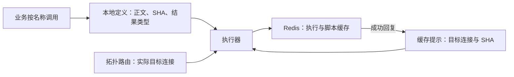
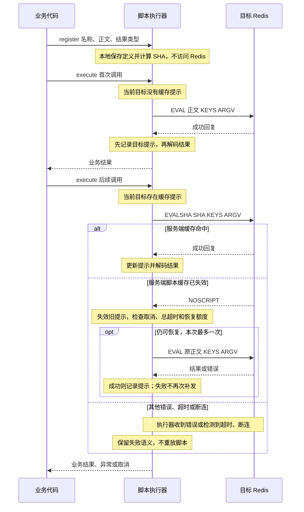

# Lua 脚本设计

## 1. 我们要解决什么问题

业务使用 Lua，通常是为了把一段判断和修改放到 Redis 中一次完成，例如扣减库存或按条件更新计数。
它关心的是执行哪段逻辑、传入什么参数、得到什么结果，而不是脚本在某个节点上有没有加载。

Redis 提供了两种执行方式：EVAL 每次携带正文，使用直接，但重复传输；EVALSHA 只携带摘要，
适合重复调用，却需要处理脚本缓存缺失。进入 Cluster 或发生主节点切换后，“某处加载过”
也不等于“这次要访问的节点上存在”。

如果让每个业务模块自行管理这些细节，就会重复编写加载、缓存判断和异常恢复代码。
更大的风险是把“没收到结果”误判成“脚本没执行”，导致重复修改数据。

因此，Boba Straw 的目标是：

> 让业务注册一次、按名称调用脚本；客户端管理执行所需的脚本缓存细节，但不替业务重试不确定的执行。

落实到 API，脚本定义放在初始化阶段，业务调用只提供名称、结果类型和本次参数。
以下示例假设已有一个长期复用的 client：

```java
// 初始化：仅在本地注册，不访问 Redis，也不执行脚本。
client.scripts().register("increment-v1",
    "return redis.call('INCRBY', KEYS[1], ARGV[1])", ScriptOutput.integer());

// 业务调用：无需保存句柄、计算 SHA 或先执行 SCRIPT LOAD。
CompletionStage<Long> result = client.scripts().execute(
    "increment-v1", ScriptOutput.integer(), new String[] {"{order}:counter"}, "1");
```

这个接口简化的是脚本管理，不是业务失败处理。正常情况下，客户端选择合适的命令并返回结果；
遇到缓存缺失，可以恢复正文后执行；遇到超时、断连等不确定结果，则明确交给调用方处理。

下面的设计围绕两个问题展开：怎样减少重复传输，又不要求本地准确追踪服务端缓存？
怎样适应缓存和拓扑变化，又不把恢复变成不安全的重试？

## 2. 核心选择：未知时 EVAL，有提示时 EVALSHA

我们不把 SCRIPT LOAD 设为执行前置步骤，而采用按需执行：

- 对实际目标没有缓存提示：发送 EVAL，成功后记录提示。
- 有提示：发送 EVALSHA，减少正文传输。
- EVALSHA 返回明确 NOSCRIPT：失效旧提示，最多补一次 EVAL。

原因在于客户端注册时已经持有完整正文，可以在本地计算 SHA-1。
EVAL 本身也能将脚本引入服务端缓存，因此第一次调用不必先 LOAD，再按返回的 SHA 执行。
恢复时同理：缺正文就直接 EVAL，不需要通过服务器重新取得摘要。
参考 [EVAL](https://redis.io/docs/latest/commands/eval/)、
[EVALSHA](https://redis.io/docs/latest/commands/evalsha/) 和 [SCRIPT LOAD](https://redis.io/docs/latest/commands/script-load/)。

### 为什么不选其他方式

| 方案 | 优点 | 没有作为默认方案的原因 |
| --- | --- | --- |
| 始终 EVAL | 最简单，不依赖缓存命中 | 每次传正文，无法利用重复调用的特点 |
| 始终 EVALSHA，缺失后 EVAL | 不维护本地提示，命中时只传摘要 | 每个冷目标先经历一次确定会失败的请求，再传正文 |
| 先 SCRIPT LOAD，再 EVALSHA | 加载和执行分开，适合显式预热 | 冷目标需要两次请求；加载成功也不保证后续缓存一直存在 |
| 未知时 EVAL，有提示时 EVALSHA | 冷目标和正常命中均只需一次脚本请求 | 采用，但需要维护有界、允许过时的提示 |

这里的“首次”指**当前 Client 对当前目标连接没有提示**，不是整个应用只发一次 EVAL。
即使服务端已由其他客户端加载过脚本，本地未知时仍会传一次正文。
重连、本地提示淘汰和并发首次调用也可能多传正文，这是有意接受的代价。

我们优先避免冷目标的额外探测和加载往返，而不是尽力省掉每一次正文传输。
提示过时时，EVALSHA + EVAL 合计两次脚本请求；不计握手和重定向，也不据此承诺所有负载都更快。

## 3. 本地保存定义，而不是复制服务端缓存

这个方案需要区分两类信息：**脚本定义是调用依据，缓存提示只是优化。**



### 定义必须稳定

名称服务于业务，SHA 服务于 Redis；用户不必把 SHA 当作业务标识。
正文按精确字节保存并计算摘要，不做 trim、换行替换或隐式改写。

同名、同正文、同结果描述的重复注册幂等；任何一项不同则拒绝，更新使用新名称或版本。
这样多个模块或并发初始化不会悄悄改变同一调用名称的含义。参数变化通过 KEYS/ARGV 表达，
不为每笔请求生成不同正文。

注册表由 Client 持有，并按条目数与正文总字节数限额，超限明确失败。
它不静默淘汰定义：业务名称不能因为一次缓存回收突然失效。Client 关闭时释放注册信息。

### 提示不必准确，但不能串目标

提示表示“这个实际目标连接曾成功执行过这个 SHA”，不表示服务器此刻一定拥有脚本。
它按 Client、物理连接身份/代次和 SHA 隔离；同一个 host:port 重建连接，也视为新的观察范围。
这不是说脚本缓存属于连接，而是客户端用连接生命周期保守地界定自己的经验。

提示可以有界淘汰。丢失提示只让下一次请求改用 EVAL，不会使注册名称不可用；
服务端缓存已丢失而提示仍在，则通过 NOSCRIPT 恢复。由此，本地不需要与服务器保持强一致。

这也决定了几个细节：

- 服务端成功就记录提示，包括 Null/空结果；业务结果解码失败不能触发重发。
- 旧连接迟到的成功不能给新连接建立提示；旧 NOSCRIPT 只失效自己观察到的记录版本。
- 首次并发调用各自 EVAL，不合并业务执行，也不等待另一笔业务调用来“完成加载”。
- 不每次 SCRIPT EXISTS：检查增加请求，而且检查后仍可能失效。
- 不向所有节点广播加载，也不在每次重连后全量预热；只为实际访问的目标提供所需正文。

这种管理方式减少了全局协调：维护少量可丢弃的经验，比维护“所有节点都加载好了”的承诺更简单。

## 4. NOSCRIPT 为什么可以恢复，超时为什么不行

两者的区别在于：在约定成立时，NOSCRIPT 明确表示本次 EVALSHA 没有找到脚本；
超时或断连只表示客户端没有得到结果，不能据此判断脚本是否修改过数据。

因此，恢复只发生在注册执行器发送 EVALSHA 后，收到顶层、精确的 NOSCRIPT 错误码时。
消息中包含该单词、嵌套结果中的错误，以及初次或恢复 EVAL 返回的同名错误，都不触发恢复。

**这个判断有一个前提：注册脚本及其调用的扩展不得伪造或转发 NOSCRIPT 为顶层业务错误。**
如果脚本先写入数据再返回同名错误，客户端无法仅凭错误码识别真相。
不满足该契约的脚本应使用直接 EVAL/evalSha，不启用注册执行器的恢复。

### 执行时序

下面按业务调用顺序，展示首次执行、后续命中以及缓存失效时的请求往返。
图中的 Redis 是本次路由选定的实际目标；MOVED/ASK 的处理在下一节说明。



每次发送前都检查取消状态和同一总超时；若恢复条件已不满足，就直接结束，不再发送 EVAL。
一次逻辑调用最多进行一次 NOSCRIPT → EVAL 恢复，不能递归补载。
BUSY、权限错误、脚本运行错误和结果解码失败都不是缓存缺失；运行错误也不保证先前写入被撤销。

原请求、恢复请求和重定向共用总 deadline，不能每换一步就重新计时。
取消生效后不再提交后续请求；已经写出的请求仍保留回复占位并排空，避免影响后续命令，
但不自动 SCRIPT KILL，也不承诺撤销服务端执行。

最后一次业务请求的实际发送状态决定失败分类。例如，NOSCRIPT 后补发的 EVAL 若发生断连，
仍可能已经执行；反之，若只在 ASKING 阶段失败、脚本尚未提交，就不能报告脚本已经发送。
这条边界比“尽量让调用成功”更重要。

## 5. 缓存失效和节点变化，如何落到同一套机制

脚本缓存不是持久化承诺。重启、切换、SCRIPT FLUSH 都可能使缓存失效；
Redis 7.4 起，通过 EVAL 引入的脚本还可能按 LRU 淘汰。
这里指脚本缓存，不是数据 Key 的过期或淘汰；也不能据此推断 SCRIPT LOAD 和各 Valkey 版本策略相同。
参考 [EVAL 缓存说明](https://redis.io/docs/latest/commands/eval/)与
[脚本缓存说明](https://redis.io/docs/latest/develop/programmability/eval-intro/)。

客户端不必针对每个失效原因设计一套加载流程。它只需回答两个问题：
**本次访问谁？对这个目标有没有提示？**

| 场景 | 处理方式 |
| --- | --- |
| 脚本被淘汰或 SCRIPT FLUSH 清除，但连接没变 | 旧提示可能仍在；EVALSHA 的 NOSCRIPT 触发一次 EVAL 恢复 |
| 节点重启或物理连接重建 | 新连接不继承旧提示，首次 EVAL |
| Cluster 扩容，新节点接管 Slot | 拓扑刷新或 MOVED 找到新目标，重新判断其提示；未知则 EVAL |
| Slot 迁移期间收到 ASK | 在目标专用连接上先 ASKING，再执行；当前不保留这种临时连接的提示，直接 EVAL |
| Cluster 缩容、旧节点退休 | 后续调用按新拓扑访问；旧连接提示不能用于新目标，不迁移或重放不确定的在途调用 |
| Cluster/Sentinel 主节点切换 | 按新主节点的实际连接判断，不因旧主节点执行成功就假定新主节点有缓存 |

扩缩容改变的是路由目标，不是本地脚本定义。因此业务无需重新注册全部脚本，
客户端也不需要在每次拓扑变化时遍历所有脚本进行预热。

这里仍有明确边界：所有 Key 必须通过 KEYS 声明，Cluster 多 Key 必须同 Slot，不拆分脚本。
零 Key 只选择一个主节点，并在一次操作中保持目标，除非收到明确路由重定向；不广播执行。

MOVED 后重新选择目标并检查提示；若已经消耗 NOSCRIPT 恢复额度，后续仍用 EVAL，不能切回 EVALSHA。
当前最多一次重定向，超过上限返回错误，不无限追赶变化中的拓扑。
ASK 的临时连接在完成、失败或取消后关闭，不更新永久 Slot 映射、不污染共享连接状态。
如果将来在同一 ASK 连接上增加 EVALSHA 恢复，恢复 EVAL 前必须再次 ASKING。

这些机制是对服务端变化的适应，不是集群运维能力，也不是扩缩容期间请求必定成功的保证。

## 6. 批量执行为什么选择不同策略

假设 Pipeline 按顺序发送“脚本 A、命令 B”。A 的 EVALSHA 如果返回 NOSCRIPT，
在整批之后补发 A，就把业务顺序改成了“B、A”。
事务也不能在 EXEC 之后补执行脚本，再假装它属于原事务。

所以批量脚本宁可多传正文，也不事后恢复：

- 注册脚本在入队时捕获定义并编码为 EVAL，使用原批量提交机制。
- 显式批量 EVALSHA 的 NOSCRIPT 作为对应位置错误报告，不补发、不重放整批。
- typed 结果沿用批次句柄；WATCH abort、整批取消、事务连接生命周期和部分错误语义保持不变。

这项选择与单次调用并不矛盾：单次执行优先减少重复传输，批量执行优先保持顺序和事务边界。
SCRIPT LOAD 不能消除加载后缓存再次变化的可能，因此也不能替代这项策略。
参考 [Redis 关于脚本与 Pipeline 的说明](https://redis.io/docs/latest/develop/programmability/eval-intro/)。

## 7. 保留透明入口，限定自动管理的职责

注册执行器是便捷入口，不替代三个直接命令。
eval 携带正文执行，scriptLoad 只加载并返回 SHA，evalSha 按摘要执行；
直接命令不隐式补发，只有 scripts().execute 明确选择上述缓存恢复。

显式预热仍有价值，但它不是全局保证。Cluster 的 scriptLoad 默认只访问一个主节点，
scriptLoadForKey 按 Key 选择当前 Slot 主节点，也不广播。
当前直接加载不更新注册执行器提示，之后首次按名称执行仍保守使用 EVAL。

execute 显式声明 ScriptOutput，并与注册时的描述做结构比较，是为了让调用处获得明确的结果类型，
而不是假装能从字符串名称推断泛型。Null、空值和解码失败保持区别；任意二进制使用 bytes，
复杂 RESP 结构使用 raw。不通过修改脚本或隐式切换 Lua 协议来迎合返回类型。

整个能力保持 Java 8、JDK-only，复用已有命令校验、NIO、取消和结果分发机制。
普通脚本不因原子执行就创建事务专用连接，也不向核心引入新的响应式运行时。
不包含 Redis Functions、脚本幂等性分析、读写分离、自动全节点预热或客户端执行 Lua。

## 阅读与状态

本设计约束继承[架构决策](decisions.md)和[命令模型](command-model.md)。
直接命令与注册执行器已实现；批量脚本及后续拓扑组合按[实施进度](../implementation/lua-scripting-progress.md)推进。
具体接口与容量上限见[使用指南](../usage/lua.md)。

本文说明机制，不将机制覆盖等同于完整场景验收。真实脚本淘汰、专用实例清缓存/重启、
完整在线扩缩容等尚未完成的专项及已有证据，统一见[测试记录](../testing/lua-scripting-validation.md)。

两张图使用 Mermaid 11.16.0 语法。
