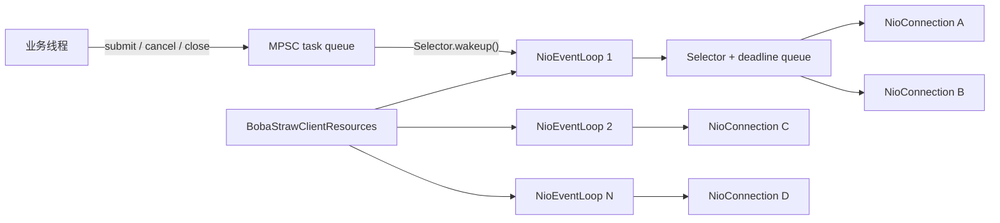
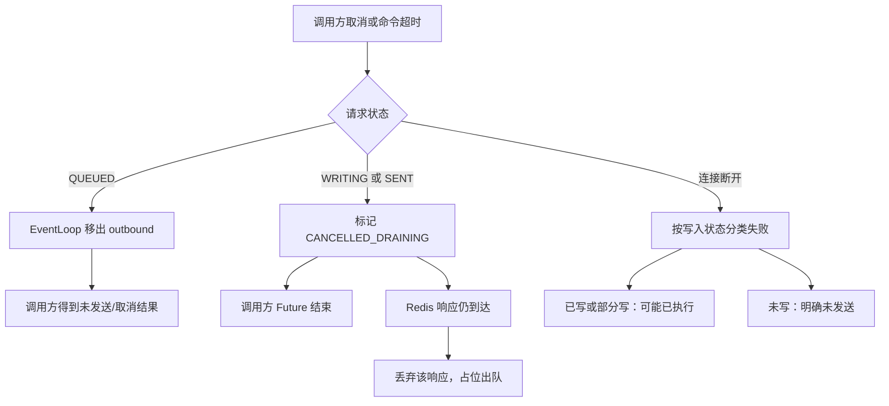
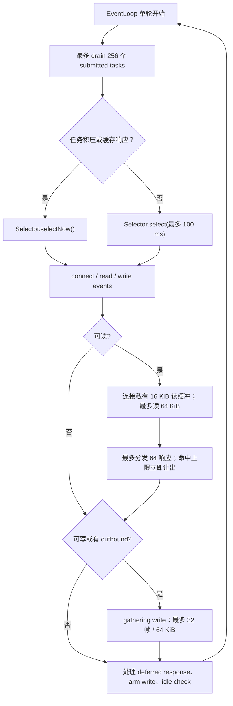
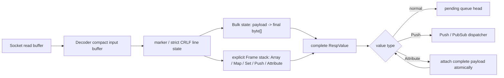

# Boba Straw 网络模型演进

本文档定义 Boba Straw 的 NIO 网络模型、并发所有权和演进顺序。它是
`NioConnection`、协议解码、取消、超时和重连实现的事实来源。

## 目标

- Java 8、JDK-only；不引入 Netty、Reactor、RxJava 或其他运行时。
- 普通命令在每个 Redis 节点复用共享连接，并保持物理连接内的 FIFO。
- 一个连接上的可变协议状态只由一个 EventLoop 修改。
- 多条连接共享有限数量的 Selector 线程，连接数不能线性增加线程数。
- 不自动重放可能已经写入 Redis 的命令。

## 当前落地状态

阶段 1 已将单个 `NioConnection` 的 `preReady`、`outbound`、`pending`、请求状态和
取消处理收敛到该连接自己的 EventLoop。业务线程只提交任务，因此不会直接与网络
写入竞争队列。

阶段 2 已将物理连接迁移到 `BobaStrawClientResources` 持有的共享
`NioEventLoopGroup`。Standalone、事务、Pub/Sub 和 Cluster 节点连接均通过统一
factory 分配给固定 EventLoop；连接创建后不迁移。默认 Client 自建并拥有一个 loop，
应用可显式传入 Resources 来让多个 Client 共享有限数量的 Selector 线程。

阶段 3 已在每个连接上复用 16 KiB heap 读缓冲，并以可复用 `ByteBuffer[]` 聚合写入。
一个 EventLoop 单轮最多执行 256 个跨线程任务；单连接最多读 64 KiB、写 64 KiB / 32 帧、
分发 64 个完整 RESP 响应。命中响应上限时立即停止继续从 socket 读入，下一轮通过
`selectNow()` 继续处理已缓存响应或可读 socket，避免 100 ms selector 等待和单连接长期独占。

阶段 4 已将 decoder 改为显式的增量状态机：它使用可 compact 的输入缓冲、流式 Bulk
状态和非递归 aggregate frame stack，不再对不完整回复反复重解析或拼接整个输入数组。
`RespLimits` 在 decoder 内强制执行，并从 Standalone、重连、事务专用池、Pub/Sub 专用
连接和 Cluster 每个节点连接统一传递。

阶段 5A 已将命令、握手、空闲 PING 和固定间隔的共享连接重连检查，收敛到所属
`NioEventLoop` 的可取消 deadline 队列。deadline 从请求创建时开始计时；在请求正常结束、
取消或连接关闭后会被取消或跳过。回调隔离、容量背压和退避重连仍属于阶段 5 的后续子阶段。

## 目标结构



```text
application threads
  | submit / cancel / close
  v
per-event-loop MPSC task queue -- wakeup --> NioEventLoop
                                             | Selector + deadline queue
                                             +-- NioConnection A
                                             +-- NioConnection B
                                             +-- NioConnection C
```

`BobaStrawClientResources` 提供可共享的 `NioEventLoopGroup`。未传入
Resources 时，Client 创建并拥有它；传入 Resources 时由调用方在应用关闭时
统一关闭。关闭一个使用外部 Resources 的 Client 只关闭该 Client 的物理连接；不会
关闭其他 Client 或 Resources。关闭 Resources 时，group 拒绝新任务、关闭所有已注册
连接并使未完成请求终止；不会自动重试。

```java
try (
    BobaStrawClientResources resources = BobaStrawClientResources.builder()
        .eventLoopThreads(2)
        .build();
    BobaStrawClient orders = BobaStrawClient.builder()
        .resources(resources)
        .uri("redis://orders-redis:6379")
        .build()) {
    // orders closes before resources, in reverse declaration order
}
```

## 命令执行流程

```mermaid
sequenceDiagram
    participant App as 业务线程
    participant Queue as EventLoop task queue
    participant Loop as NioEventLoop
    participant Redis as Redis/Valkey

    App->>App: 编码不可变命令帧
    App->>Queue: submit(request)
    App->>Loop: Selector.wakeup()
    Loop->>Queue: drain tasks
    Loop->>Loop: 加入 outbound FIFO
    Loop->>Redis: gathering write（最多 32 帧 / 64 KiB）
    Loop->>Loop: 仅完整帧从 outbound -> pending
    Redis-->>Loop: RESP response / Push / Attribute
    Loop->>Loop: 增量状态机解码、资源校验与响应分类
    alt 普通响应
        Loop->>Loop: pending 队首匹配
        Loop-->>App: complete CompletionStage
    else RESP3 Push 或 Pub/Sub 消息
        Loop-->>App: dispatcher 保序分发
    else Attribute + 普通响应
        Loop->>Loop: 保留 Attribute 并匹配 pending 队首
        Loop-->>App: complete CompletionStage
    end
```

## 取消与失败流程



## 连接所有权

业务线程只能创建不可变命令帧，并提交以下任务：发送、取消、关闭。
`outbound`、`pending`、`SelectionKey`、协议 decoder、握手状态、空闲 PING
状态和 deadline 只能由所属 EventLoop 读写。

请求状态如下：

```text
QUEUED -> WRITING -> SENT -> COMPLETED
            |          |
            +----------+-> CANCELLED_DRAINING -> COMPLETED
QUEUED -> CANCELLED
```

- `QUEUED` 取消：从待写队列移除，Redis 明确未收到该请求。
- 请求只在自身 `ByteBuffer` 的 position 实际前进后从 `QUEUED` 进入 `WRITING`；零字节
  写入后的取消仍可安全移除，不会污染协议队列。
- `WRITING`/`SENT` 取消：对调用方结束 Future，但保留协议占位，收到响应后
  丢弃该响应，防止它匹配到下一条请求。
- 断连时：未写出的请求和可能已写出的请求使用不同失败分类；若一次 gathering write
  直接抛出 I/O 异常，参与该次 write 的帧保守地标记为“可能已写出”，两者均不重试。

## 网络、协议与分发

阶段 3 已将 EventLoop 单轮服务切片固定为：最多执行 256 个跨线程任务，处理 selector
事件，然后让每条被选中的连接最多读 64 KiB、聚合写 32 帧 / 64 KiB，并最多分发 64 个
完整 RESP 响应。若任务积压或 decoder 已有完整响应待分发，loop 使用 `selectNow()`，
而不是等待正常的最多 100 ms selector 超时。

这些数值由 package-private `NioIoLimits` 管理，暂不暴露为业务配置；它们是公平性保护，
不是吞吐调优承诺，后续以 JMH 与负载压测结果校准。



- 写入使用连接私有的可复用 `ByteBuffer[]`、请求引用和写前 position 数组；一次
  `SocketChannel.write(ByteBuffer[])` 最多聚合 32 帧和 64 KiB。若最后一帧被预算截断，
  临时收窄的 limit 必须在推进 `outbound -> pending` 前恢复，防止响应 FIFO 错位。
- 每个连接复用 heap 读缓冲；最大一次读服务为 64 KiB，但达到完整响应分发上限时不会
  继续向 decoder 灌入数据。decoder 使用可 compact 的内部输入缓冲；一个 Bulk payload
  完整到达后只从该缓冲复制到最终 `byte[]` 一次，不会因为后续碎片而重新解析已完成部分。
- 同一 EventLoop 单轮中，socket 读入和其他内部 transport 共用一个响应分发余额；不能
  因多次输入而绕过 64 个响应的服务上限。
- RESP3 Push 与 Attribute 在进入普通 `pending` 队列前分流。Attribute 关联
  的普通响应仍严格匹配队首请求。
- Pub/Sub listener 和 `CompletionStage` 的非 async continuation 当前仍可能运行在
  EventLoop；阶段 5 将提供有界 dispatcher / 可选 callback executor，届时不得让业务
  回调阻塞网络线程。
- Pub/Sub 专用连接在具备命令感知的 RESP3 `pong` 匹配前不发送 idle PING；避免
  `pong` Push 被误当作普通命令响应。

### RESP 增量状态机与资源上限



`RespCodec.Decoder` 保留 `feed(byte[], int)` / `poll()` 兼容接口，但内部不使用递归。
未完整的 line、Bulk 和 aggregate 只保留必要状态；下一段字节从上次位置继续。Attribute
frame 必须同时收齐 `2 * attributeCount` 个键值和其后的完整 payload 才能产出，因此
Attribute 不会抢占 Push 或普通回复的 FIFO 位置。

每条物理连接使用一份不可变的 `RespLimits`。默认值为：

- `maxBufferedBytes`：64 MiB 的未解码 wire 输入；
- `maxResponseBytes`：64 MiB 的单个顶层回复 wire 字节；
- `maxBulkLength`：32 MiB 的 Blob / Blob Error / Verbatim payload；
- `maxLineLength`：64 KiB；`maxNestingDepth`：64；
- `maxAggregateElements`：100,000 个累计 aggregate child。

违反 RESP 格式、CRLF 终止规则或任一限制都会产生 `BobaStrawProtocolException` 并终止
该物理连接。已写出的请求仍按“可能已执行”失败，未写出的请求仍按“明确未发送”失败；
不会截断回复、错配 pending 队列或自动重试。`RespLimits` 是 Client 配置而不是共享
`BobaStrawClientResources` 配置，因此共享同一组 selector 的 Client 可以使用不同限制。

## Deadline、健康检查与背压

阶段 5A 已使每个 EventLoop 持有 deadline 队列，统一管理命令超时、握手、空闲 PING 和
固定间隔的共享连接重连检查。deadline 使用单调时钟；请求在创建时开始计时，已完成、取消或
关闭的请求会取消其 deadline，过期的请求只在所属 EventLoop 上改变队列状态。未发送的超时
请求返回“未发送”语义；已开始写入的超时请求进入 `CANCELLED_DRAINING`，仍保留协议占位，
并返回“可能已执行”语义。调用方可通过
`BobaStrawCommandTimeoutException.mayHaveExecuted()` 读取这一区分。
同步 API 只等待同一异步请求的结果，不再建立第二套独立的超时定时器。

当前重连仍是固定间隔检查，不重放任何命令。指数退避、连接状态与更细粒度指标属于后续子阶段。

连接必须提供有界保护：最大 in-flight 命令数、最大待写字节、最大 RESP 响应、
最大 Pub/Sub 分发积压。超限时本地明确拒绝，不能静默丢弃或无限缓存。

## 分阶段实施与验收

1. **连接正确性**：收敛队列状态所有权，修复取消/写入竞态；Future 在锁外完成。
2. **共享 EventLoopGroup**：多个连接共享有限 Selector 线程，并完成生命周期测试。
3. **I/O 吞吐**：复用读缓冲、写入聚合、读写公平预算。
4. **RESP 增量状态机（已完成）**：减少累积复制和碎片重解析，并加入协议资源上限。
5. **背压与回调隔离**：有界队列、统一 deadline、Pub/Sub dispatcher、可选 callback executor。
6. **基准与故障注入**：并发取消、部分写、断连、慢消费者、Redis/Valkey 矩阵和 JMH。

每阶段都必须保留 Java 8 兼容、执行 `mvn test`，并添加针对碎片输入、响应匹配、
资源关闭和失败语义的测试。阶段完成前不得将下一阶段能力标记为生产可用。

### 阶段 1 验收（已完成）

- 握手尚未完成时并发提交的普通命令保存在 `preReady`，激活后按 FIFO 转入
  `outbound`；不依赖 `CompletableFuture` 回调的执行顺序。
- 取消待写请求会从队列移除；写入中或已发送请求进入
  `CANCELLED_DRAINING`，其响应只用于恢复协议队列位置，绝不交给下一请求。
- 普通连接上的 RESP3 `Attribute(Push)` 会在进入 `pending` 前分流；Pub/Sub
  专用连接把订阅/退订 Push 确认匹配到对应请求，把消息分发给 listener。
- 连接在任何命令字节写出前失败时返回 `BobaStrawCommandNotSentException`；写出
  过任意字节后失败时返回 `BobaStrawCommandMayHaveExecutedException`；两种情况均不重试。
- 以上路径由回环假 Redis 测试覆盖，并通过完整 `mvn test` 回归。

### 阶段 2 验收（已完成）

- `BobaStrawClientResources` 可配置固定数量的 selector 线程；默认 Client 资源使用
  一个线程，外部 Resources 可被多个 Client 共享。
- 一个 `NioConnection` 固定绑定到一个 loop。连接的 connect、SelectionKey、读写、
  握手、空闲检查、关闭及 FIFO 队列仍只由该 loop 修改。
- Standalone 重连、事务池、Pub/Sub 专用连接、Cluster seed/拓扑节点连接均经由
  `NioConnectionFactory` 创建，不能回退到“一连接一线程”。
- 单条连接断开只终止该连接；同一 EventLoop 上的其他连接继续服务。外部 Resources
  的 Client 相互关闭隔离；关闭 Resources 会使在途请求终止并拒绝后续命令。
- 上述生命周期语义由 `BobaStrawClientResourcesTest` 与既有协议/Cluster 回归覆盖，
  并通过完整 `mvn test`。

### 阶段 3 验收（已完成）

- 每个连接仅分配一次 16 KiB heap 读缓冲，并复用 gathering write 所需的 buffer / request
  数组；不会在每次 socket read 时创建临时 `ByteBuffer`。
- 单轮任务、读、写和已解码响应均有内部预算：256 个任务、64 KiB 读、32 帧 / 64 KiB
  写、64 个完整响应。已缓存响应会驱动 `selectNow()`，不会等待固定 selector 超时。
- 写入状态只在实际 position 前进后变为 `WRITING`；部分帧、取消、临时写 limit 恢复和
  `outbound -> pending` 推进均保持物理连接 FIFO。写 syscall 异常的参与帧按“可能已执行”
  保守失败，绝不自动重试。
- `NioConnectionIoTest` 以小预算验证大帧 + 后续命令的 RESP 帧完整性和顺序，并验证
  响应 burst 每个 EventLoop turn 只分发预算内的响应；同一 loop 上繁忙 burst 也会让出
  已就绪的另一连接。既有碎片协议与取消测试继续回归。

### 阶段 4 验收（已完成）

- `RespCodec.Decoder` 通过显式 frame stack 解析 RESP2/RESP3 aggregate，不使用递归；
  累积输入采用 compact buffer，Bulk payload 以流式状态写入最终值，避免碎片输入的整段
  拼接与已完成节点的反复解析。
- 解析器严格校验 line 的 `CRLF`、Bulk trailer、RESP3 Null、Boolean 与 Verbatim 结构。
  任意协议格式错误或资源超限使 decoder 进入终止状态，连接层关闭相应 socket。
- `RespLimits` 保护 buffer、顶层回复、Bulk、line、aggregate depth 和累计元素数；默认值
  可由 `BobaStrawClient.Builder.respLimits(...)` 与
  `BobaStrawClusterClient.Builder.respLimits(...)` 覆盖，并完整传入重连、事务、Pub/Sub 和
  Cluster 节点连接。
- 单元测试覆盖逐字节/任意边界碎片的嵌套 Attribute、连续 Push/普通回复、大 Bulk、输入
  数组复用、非法 wire 和所有资源限制边界；socket 测试验证协议超限关闭连接并保留已写命令
  的“可能已执行”语义。完整 `mvn test` 回归后才可进入阶段 5。

### 阶段 5A 验收（已完成，阶段 5 其余部分仍进行中）

- 每个 `NioEventLoop` 使用自己的可取消 deadline 队列，并在 selector 等待前以最近 deadline
  计算等待时间；到期任务和普通 NIO I/O 都只在该 EventLoop 上执行。
- 普通命令、握手命令和空闲 PING 共享同一请求 deadline 模型。取消或超时的已写请求保留
  `CANCELLED_DRAINING` 响应占位，不能让后续响应错配。
- 共享连接的固定间隔重连检查由其当前连接所属 EventLoop 调度；Client 关闭或连接替换通过
  generation 使旧检查失效。检查仅创建新连接，绝不重发失败或超时命令。
- `NioEventLoopDeadlineTest` 覆盖 deadline 所属线程、取消和 EventLoop 存活；协议 socket
  测试覆盖命令 deadline。完整 `mvn test` 回归后才可继续阶段 5B。

### 阶段 6 性能验收计划（待阶段 4、5 完成后执行）

- 先探测本机 JDK、Colima 与容器运行状况；缺少的 JDK、JMH 构建依赖、Redis / Valkey
  镜像和观测工具可直接安装。环境版本、镜像 digest、CPU 核数、内存、JVM 参数与命令必须
  写入 `docs/benchmarks/`，使结果可复跑。
- 同时保留阶段 2 提交 `ca078f4` 和网络模型最终提交的基线，分别在 Redis 与 Valkey 上
  运行同一组工作负载：单命令 GET / SET、1/16/128 命令 Pipeline、大 value、碎片响应、
  多 Client 共享一个 EventLoop 的 noisy-neighbor 场景，以及阶段 5 完成后的 Pub/Sub
  慢消费者场景。
- 记录吞吐、P50/P95/P99/P999 延迟、分配率、GC、CPU、线程数、socket read/write 次数和
  每连接完成量；公平性以繁忙连接与健康连接的完成量和尾延迟共同判断，不能只报平均值。
- 每个 JMH workload 至少包含 warmup、多个 measurement fork 和原始 JSON/文本输出；
  网络端到端压测另保留客户端 / server 侧指标。没有完成这些步骤前，不对吞吐或延迟作
  生产性能承诺。
