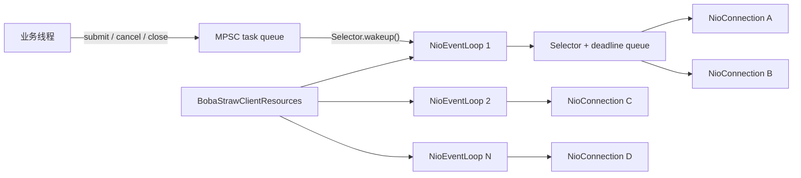
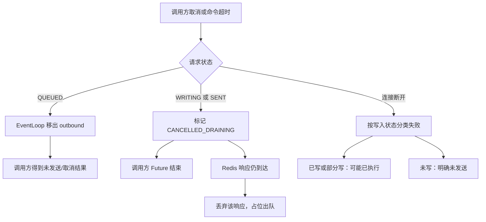
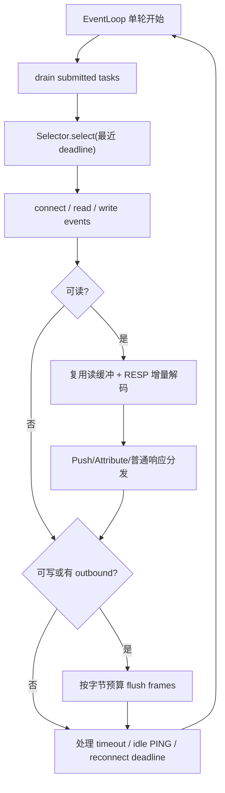

# Boba Straw 网络模型演进

本文档定义 Boba Straw 的 NIO 网络模型、并发所有权和演进顺序。它是
`NioConnection`、协议解码、取消、超时和重连实现的事实来源。

## 目标

- Java 8、JDK-only；不引入 Netty、Reactor、RxJava 或其他运行时。
- 普通命令在每个 Redis 节点复用共享连接，并保持物理连接内的 FIFO。
- 一个连接上的可变协议状态只由一个 EventLoop 修改。
- 多条连接共享有限数量的 Selector 线程，连接数不能线性增加线程数。
- 不自动重放可能已经写入 Redis 的命令。

## 当前落地状态

阶段 1 已将单个 `NioConnection` 的 `preReady`、`outbound`、`pending`、请求状态和
取消处理收敛到该连接自己的 EventLoop。业务线程只提交任务，因此不会直接与网络
写入竞争队列。

阶段 2 已将物理连接迁移到 `BobaStrawClientResources` 持有的共享
`NioEventLoopGroup`。Standalone、事务、Pub/Sub 和 Cluster 节点连接均通过统一
factory 分配给固定 EventLoop；连接创建后不迁移。默认 Client 自建并拥有一个 loop，
应用可显式传入 Resources 来让多个 Client 共享有限数量的 Selector 线程。

读缓冲复用、gathering write、真正的 RESP 状态机、背压和回调隔离仍在后续阶段。

## 目标结构



```text
application threads
  | submit / cancel / close
  v
per-event-loop MPSC task queue -- wakeup --> NioEventLoop
                                             | Selector
                                             | deadline queue
                                             +-- NioConnection A
                                             +-- NioConnection B
                                             +-- NioConnection C
```

`BobaStrawClientResources` 提供可共享的 `NioEventLoopGroup`。未传入
Resources 时，Client 创建并拥有它；传入 Resources 时由调用方在应用关闭时
统一关闭。关闭一个使用外部 Resources 的 Client 只关闭该 Client 的物理连接；不会
关闭其他 Client 或 Resources。关闭 Resources 时，group 拒绝新任务、关闭所有已注册
连接并使未完成请求终止；不会自动重试。

```java
try (
    BobaStrawClientResources resources = BobaStrawClientResources.builder()
        .eventLoopThreads(2)
        .build();
    BobaStrawClient orders = BobaStrawClient.builder()
        .resources(resources)
        .uri("redis://orders-redis:6379")
        .build()) {
    // orders closes before resources, in reverse declaration order
}
```

## 命令执行流程

```mermaid
sequenceDiagram
    participant App as 业务线程
    participant Queue as EventLoop task queue
    participant Loop as NioEventLoop
    participant Redis as Redis/Valkey

    App->>App: 编码不可变命令帧
    App->>Queue: submit(request)
    App->>Loop: Selector.wakeup()
    Loop->>Queue: drain tasks
    Loop->>Loop: 加入 outbound FIFO
    Loop->>Redis: non-blocking write
    Loop->>Loop: outbound -> pending
    Redis-->>Loop: RESP response / Push / Attribute
    Loop->>Loop: 增量解码与响应分类
    alt 普通响应
        Loop->>Loop: pending 队首匹配
        Loop-->>App: complete CompletionStage
    else RESP3 Push 或 Pub/Sub 消息
        Loop-->>App: dispatcher 保序分发
    else Attribute + 普通响应
        Loop->>Loop: 保留 Attribute 并匹配 pending 队首
        Loop-->>App: complete CompletionStage
    end
```

## 取消与失败流程



## 连接所有权

业务线程只能创建不可变命令帧，并提交以下任务：发送、取消、关闭。
`outbound`、`pending`、`SelectionKey`、协议 decoder、握手状态、空闲 PING
状态和 deadline 只能由所属 EventLoop 读写。

请求状态如下：

```text
QUEUED -> WRITING -> SENT -> COMPLETED
            |          |
            +----------+-> CANCELLED_DRAINING -> COMPLETED
QUEUED -> CANCELLED
```

- `QUEUED` 取消：从待写队列移除，Redis 明确未收到该请求。
- `WRITING`/`SENT` 取消：对调用方结束 Future，但保留协议占位，收到响应后
  丢弃该响应，防止它匹配到下一条请求。
- 断连时：未写出的请求和可能已写出的请求使用不同失败分类；两者均不重试。

## 网络、协议与分发

阶段 3 的目标 EventLoop 单轮按以下顺序工作：排空跨线程任务、按最近 deadline 等待
Selector、处理 connect/read/write、处理定时任务，并对每轮读写施加字节预算，避免
超大 Pipeline 长时间独占线程。当前阶段 2 尚未加入任务、读或写预算；高负载连接可能
暂时占用同组 loop，这也是阶段 3 未标记为完成的原因。



- 写入使用帧队列，并在后续阶段使用 gathering write 降低 payload 拷贝和
  syscall 次数。
- 每个连接复用读缓冲；禁止在每次 `read()` 分配临时 ByteBuffer。
- RESP decoder 使用可 compact 的累积缓冲和容器状态栈。碎片输入不得重复复制
  或重新解析已经确认的前缀。
- RESP3 Push 与 Attribute 在进入普通 `pending` 队列前分流。Attribute 关联
  的普通响应仍严格匹配队首请求。
- Pub/Sub listener 和可选异步回调 executor 不得阻塞 EventLoop。
- Pub/Sub 专用连接在具备命令感知的 RESP3 `pong` 匹配前不发送 idle PING；避免
  `pong` Push 被误当作普通命令响应。

## Deadline、健康检查与背压

每个 EventLoop 持有 deadline 队列，统一管理命令超时、空闲 PING 和重连退避。
已完成请求的 deadline 必须被取消或跳过，不能无限积累定时任务。

连接必须提供有界保护：最大 in-flight 命令数、最大待写字节、最大 RESP 响应、
最大 Pub/Sub 分发积压。超限时本地明确拒绝，不能静默丢弃或无限缓存。

## 分阶段实施与验收

1. **连接正确性**：收敛队列状态所有权，修复取消/写入竞态；Future 在锁外完成。
2. **共享 EventLoopGroup**：多个连接共享有限 Selector 线程，并完成生命周期测试。
3. **I/O 吞吐**：复用读缓冲、写入聚合、读写公平预算。
4. **RESP 增量状态机**：减少累积复制和碎片重解析，并加入协议资源上限。
5. **背压与回调隔离**：有界队列、统一 deadline、Pub/Sub dispatcher、可选 callback executor。
6. **基准与故障注入**：并发取消、部分写、断连、慢消费者、Redis/Valkey 矩阵和 JMH。

每阶段都必须保留 Java 8 兼容、执行 `mvn test`，并添加针对碎片输入、响应匹配、
资源关闭和失败语义的测试。阶段完成前不得将下一阶段能力标记为生产可用。

### 阶段 1 验收（已完成）

- 握手尚未完成时并发提交的普通命令保存在 `preReady`，激活后按 FIFO 转入
  `outbound`；不依赖 `CompletableFuture` 回调的执行顺序。
- 取消待写请求会从队列移除；写入中或已发送请求进入
  `CANCELLED_DRAINING`，其响应只用于恢复协议队列位置，绝不交给下一请求。
- 普通连接上的 RESP3 `Attribute(Push)` 会在进入 `pending` 前分流；Pub/Sub
  专用连接把订阅/退订 Push 确认匹配到对应请求，把消息分发给 listener。
- 连接在任何命令字节写出前失败时返回 `BobaStrawCommandNotSentException`；写出
  过任意字节后失败时返回 `BobaStrawCommandMayHaveExecutedException`；两种情况均不重试。
- 以上路径由回环假 Redis 测试覆盖，并通过完整 `mvn test` 回归。

### 阶段 2 验收（已完成）

- `BobaStrawClientResources` 可配置固定数量的 selector 线程；默认 Client 资源使用
  一个线程，外部 Resources 可被多个 Client 共享。
- 一个 `NioConnection` 固定绑定到一个 loop。连接的 connect、SelectionKey、读写、
  握手、空闲检查、关闭及 FIFO 队列仍只由该 loop 修改。
- Standalone 重连、事务池、Pub/Sub 专用连接、Cluster seed/拓扑节点连接均经由
  `NioConnectionFactory` 创建，不能回退到“一连接一线程”。
- 单条连接断开只终止该连接；同一 EventLoop 上的其他连接继续服务。外部 Resources
  的 Client 相互关闭隔离；关闭 Resources 会使在途请求终止并拒绝后续命令。
- 上述生命周期语义由 `BobaStrawClientResourcesTest` 与既有协议/Cluster 回归覆盖，
  并通过完整 `mvn test`。
