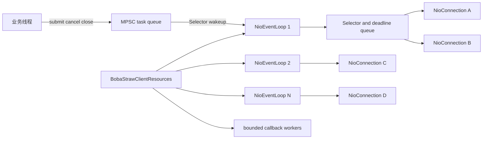
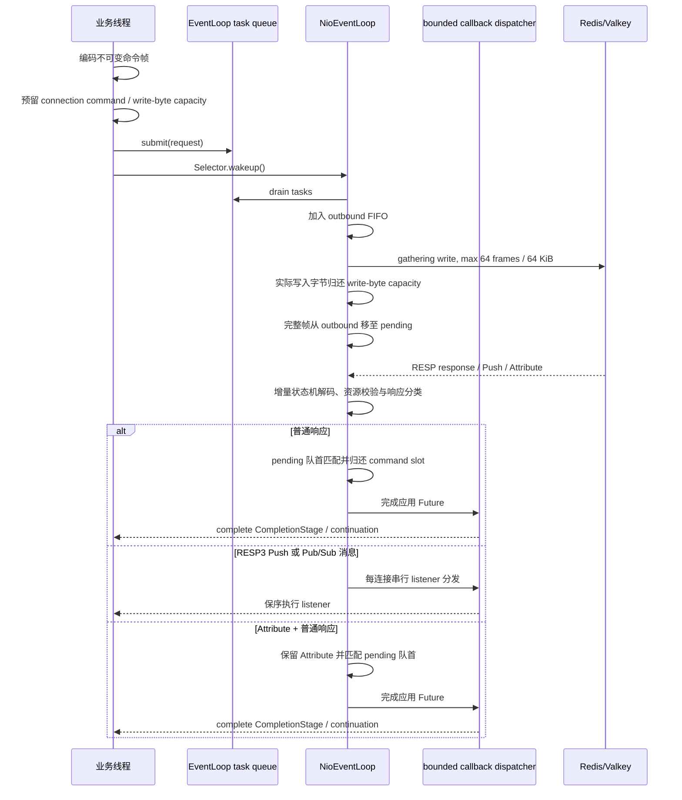
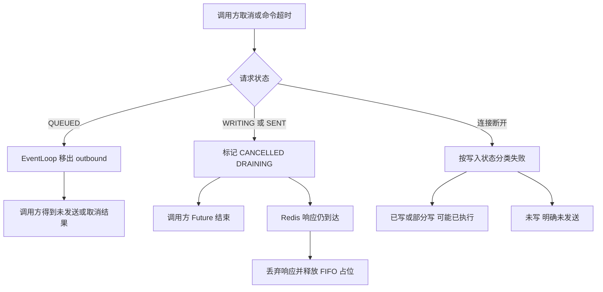
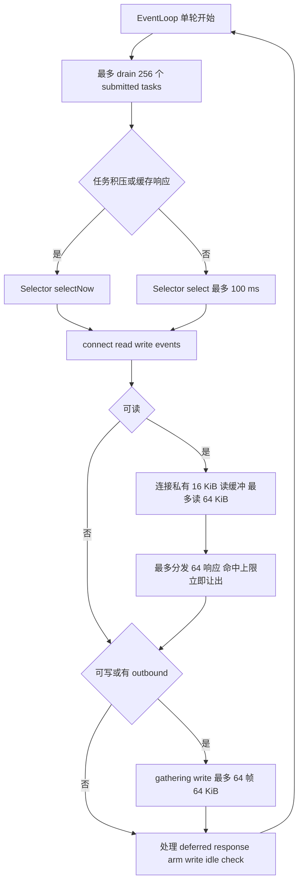
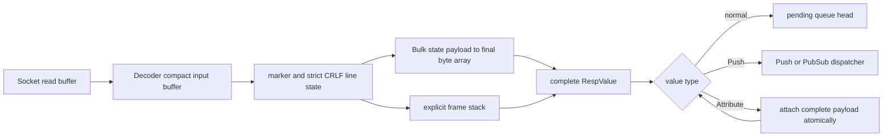
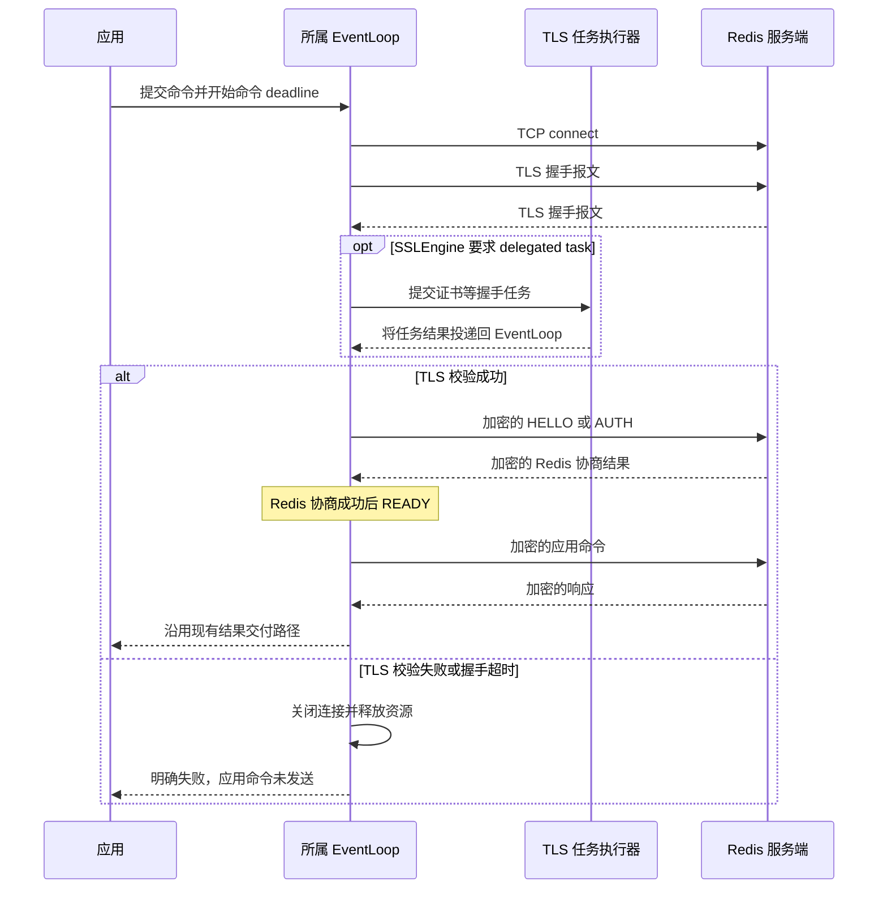
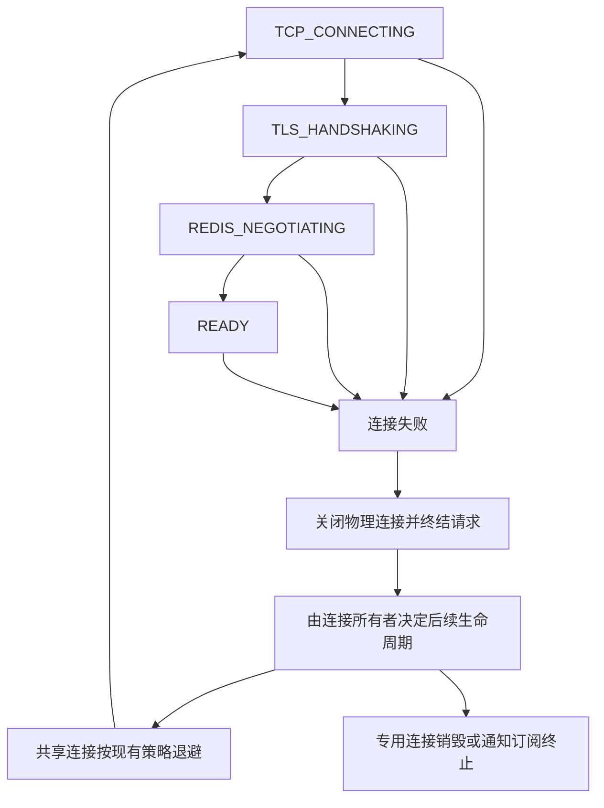

# Boba Straw 网络模型

本文档定义 Boba Straw 的 NIO 网络模型、并发所有权和执行边界。它是
`NioConnection`、协议解码、取消、超时和重连实现的事实来源。

本文中的图使用 Mermaid **11.16.0** 语法作为校验基线（与 VS Code 的 Mermaid 预览版本保持
一致）。为避免 renderer 差异，flowchart 统一使用 `graph LR` / `graph TD`，节点与连线标签
不嵌入 `[]`、`->` 或复杂引号。

## 目标

- Java 8、JDK-only；不引入 Netty、Reactor、RxJava 或其他运行时。
- 普通命令在每个 Redis 节点复用共享连接，并保持物理连接内的 FIFO。
- 一个连接上的可变协议状态只由一个 EventLoop 修改。
- 多条连接共享有限数量的 Selector 线程，连接数不能线性增加线程数。
- 不自动重放可能已经写入 Redis 的命令。

## 当前结构概览

`NioConnection` 将其 `preReady`、`outbound`、`pending`、请求状态和
取消处理收敛到该连接自己的 EventLoop。业务线程只提交任务，因此不会直接与网络
写入竞争队列。

物理连接通过统一 factory 分配到 `BobaStrawClientResources` 持有的共享
`NioEventLoopGroup`。Standalone、事务、Pub/Sub 和 Cluster 节点连接均通过统一
factory 分配给固定 EventLoop；连接创建后不迁移。默认 Client 自建并拥有一个 loop，
应用可显式传入 Resources 来让多个 Client 共享有限数量的 Selector 线程。

每个连接上复用 16 KiB heap 读缓冲，并以可复用 `ByteBuffer[]` 聚合写入。
一个 EventLoop 单轮最多执行 256 个跨线程任务；单连接最多读 64 KiB、写 64 KiB / 64 帧、
分发 64 个完整 RESP 响应。命中响应上限时立即停止继续从 socket 读入，下一轮通过
`selectNow()` 继续处理已缓存响应或可读 socket，避免 100 ms selector 等待和单连接长期独占。

decoder 使用显式的增量状态机：它使用可 compact 的输入缓冲、流式 Bulk
状态和非递归 aggregate frame stack，不再对不完整回复反复重解析或拼接整个输入数组。
`RespLimits` 在 decoder 内强制执行，并从 Standalone、重连、事务专用池、Pub/Sub 专用
连接和 Cluster 每个节点连接统一传递。

命令、握手和空闲 PING 使用所属 `NioEventLoop` 的可取消 deadline
队列。deadline 从请求创建时开始计时；在请求正常结束、取消或连接关闭后会被取消或跳过。

应用可见的 `CompletionStage` 完成和 Pub/Sub listener 转交给
`BobaStrawClientResources` 持有的有界 callback dispatcher。普通命令在写入前先预留一个
callback slot；若没有容量则本地返回 `BobaStrawBackpressureException`，不会发送 Redis 命令。
每个 Pub/Sub 连接使用串行分发器保留消息顺序；慢消费者耗尽容量时关闭该专用连接，绝不静默
丢弃消息。同步 API 直接等待内部 transport 完成，不会因为业务 callback worker 被占满而
无限等待。

每条物理连接具有独立的命令准入上限：默认最多 4,096 条应用命令和 16 MiB
尚未写入 socket 的编码帧。命令数从准入到响应排空一直占位；待写字节则随着实际
`SocketChannel.write` 的 position 前进逐步归还。准入失败返回
`BobaStrawBackpressureException` 且不会写 Redis。Standalone 的共享连接在 close lifecycle
上驱动重连，使用 base interval 至 max interval 的指数退避；它从不迁移或重放失败命令。
Pub/Sub 的退订 ACK 到达后立即释放该专用连接的 socket 和 Selector；ACK 前已接受的 listener
仍由 serial barrier 保序排空，随后关闭该 callback stream。慢 listener 因而不会长期占用物理连接；
若 Client 在排空期间关闭，尚未开始的 listener 会被取消。

## EventLoop 结构


```mermaid
graph LR
    App[业务线程] -->|submit cancel close| Tasks[MPSC task queue]
    Tasks -->|Selector wakeup| Loop1[NioEventLoop 1]
    Resources[BobaStrawClientResources] --> Loop1
    Resources --> Loop2[NioEventLoop 2]
    Resources --> LoopN[NioEventLoop N]
    Resources --> Callbacks[bounded callback workers]
    Loop1 --> Selector1[Selector and deadline queue]
    Selector1 --> A[NioConnection A]
    Selector1 --> B[NioConnection B]
    Loop2 --> C[NioConnection C]
    LoopN --> D[NioConnection D]
```

```text
application threads
  | submit / cancel / close
  v
per-event-loop MPSC task queue -- wakeup --> NioEventLoop
                                             | Selector + deadline queue
                                             +-- NioConnection A
                                             +-- NioConnection B
                                             +-- NioConnection C

BobaStrawClientResources -- bounded queue --> callback workers
```

`BobaStrawClientResources` 提供可共享的 `NioEventLoopGroup`。未传入
Resources 时，Client 创建并拥有它；传入 Resources 时由调用方在应用关闭时
统一关闭。关闭一个使用外部 Resources 的 Client 只关闭该 Client 的物理连接；不会
关闭其他 Client 或 Resources。关闭 Resources 时，group 拒绝新任务、关闭所有已注册
连接并使未完成请求终止；已接受的 callback 完成任务会继续排空。不会自动重试。

```java
try (
    BobaStrawClientResources resources = BobaStrawClientResources.builder()
        .eventLoopThreads(2)
        .callbackThreads(2)
        .callbackQueueCapacity(2048)
        .build();
    BobaStrawClient orders = BobaStrawClient.builder()
        .resources(resources)
        .uri("redis://orders-redis:6379")
        .build()) {
    // orders closes before resources, in reverse declaration order
}
```

## 命令执行流程


```mermaid
sequenceDiagram
    participant App as 业务线程
    participant Queue as EventLoop task queue
    participant Nio as NioEventLoop
    participant Callback as bounded callback dispatcher
    participant Redis as Redis/Valkey

    App->>App: 编码不可变命令帧
    App->>App: 预留 connection command / write-byte capacity
    App->>Queue: submit(request)
    App->>Nio: Selector.wakeup()
    Nio->>Queue: drain tasks
    Nio->>Nio: 加入 outbound FIFO
    Nio->>Redis: gathering write, max 64 frames / 64 KiB
    Nio->>Nio: 实际写入字节归还 write-byte capacity
    Nio->>Nio: 完整帧从 outbound 移至 pending
    Redis-->>Nio: RESP response / Push / Attribute
    Nio->>Nio: 增量状态机解码、资源校验与响应分类
    alt 普通响应
        Nio->>Nio: pending 队首匹配并归还 command slot
        Nio->>Callback: 完成应用 Future
        Callback-->>App: complete CompletionStage / continuation
    else RESP3 Push 或 Pub/Sub 消息
        Nio->>Callback: 每连接串行 listener 分发
        Callback-->>App: 保序执行 listener
    else Attribute + 普通响应
        Nio->>Nio: 保留 Attribute 并匹配 pending 队首
        Nio->>Callback: 完成应用 Future
        Callback-->>App: complete CompletionStage / continuation
    end
```

## 取消与失败流程


```mermaid
graph TD
    Start[调用方取消或命令超时] --> State{请求状态}
    State -->|QUEUED| Remove[EventLoop 移出 outbound]
    Remove --> NotSent[调用方得到未发送或取消结果]
    State -->|WRITING 或 SENT| Drain[标记 CANCELLED DRAINING]
    Drain --> CallerDone[调用方 Future 结束]
    Drain --> Reply[Redis 响应仍到达]
    Reply --> Drop[丢弃响应并释放 FIFO 占位]
    State -->|连接断开| Classify[按写入状态分类失败]
    Classify --> Maybe[已写或部分写 可能已执行]
    Classify --> Never[未写 明确未发送]
```

## 连接所有权

业务线程只能创建不可变命令帧，并提交以下任务：发送、取消、关闭。
binary typed 路径将参数直接编码为 internal EncodedCommand；只读 ByteBuffer 不暴露底层数组，
每个请求独占自己的 position/limit，与其他路径汇入相同的准入、排队和写入逻辑。
该对象不授权命令、不绕过普通命令元数据检查，也不创建重试路径。
`outbound`、`pending`、`SelectionKey`、协议 decoder、握手状态、空闲 PING
状态和 deadline 只能由所属 EventLoop 读写。

连接准入计数是唯一例外：它是一个极短的线程安全 reservation，用于让多个 producer 在提交
EventLoop task 前原子地拒绝超限命令；它不读取或修改协议队列。EventLoop 仍是 request 状态、
写入进度和 reservation 归还时机的唯一所有者。

请求状态如下：

```text
QUEUED -> WRITING -> SENT -> COMPLETED
            |          |
            +----------+-> CANCELLED_DRAINING -> COMPLETED
QUEUED -> CANCELLED
```

- `QUEUED` 取消：从待写队列移除，Redis 明确未收到该请求。
- 请求只在自身 `ByteBuffer` 的 position 实际前进后从 `QUEUED` 进入 `WRITING`；零字节
  写入后的取消仍可安全移除，不会污染协议队列。
- `WRITING`/`SENT` 取消：对调用方结束 Future，但保留协议占位，收到响应后
  丢弃该响应，防止它匹配到下一条请求。
- 断连时：未写出的请求和可能已写出的请求使用不同失败分类；若一次 gathering write
  直接抛出 I/O 异常，参与该次 write 的帧保守地标记为“可能已写出”，两者均不重试。

## 网络、协议与分发

EventLoop 单轮服务切片固定为：最多执行 256 个跨线程任务，处理 selector 事件，然后让每条
被选中的连接最多读 64 KiB、聚合写 64 帧 / 64 KiB，并最多分发 64 个
完整 RESP 响应。若任务积压或 decoder 已有完整响应待分发，loop 使用 `selectNow()`，
而不是等待正常的最多 100 ms selector 超时。

这些数值由 package-private `NioIoLimits` 管理，暂不暴露为业务配置；它们是公平性保护，
不是吞吐调优承诺。当前采用 64 frames / 64 KiB；32、128 和 64 帧候选的取舍与当时
验收结果见[网络模型演进记录](../implementation/network-model-history.md)。旧实验不能替代
当前发布版本的性能回归；最新结论以[核心验证记录](../implementation/core-completion-plan.md)为准。


```mermaid
graph TD
    Begin[EventLoop 单轮开始] --> Tasks[最多 drain 256 个 submitted tasks]
    Tasks --> Ready{任务积压或缓存响应}
    Ready -->|是| Poll[Selector selectNow]
    Ready -->|否| Wait[Selector select 最多 100 ms]
    Poll --> Events[connect read write events]
    Wait --> Events
    Events --> Read{可读}
    Read -->|是| Decode[连接私有 16 KiB 读缓冲 最多读 64 KiB]
    Decode --> Dispatch[最多分发 64 响应 命中上限立即让出]
    Read -->|否| Write
    Dispatch --> Write{可写或有 outbound}
    Write -->|是| Flush[gathering write 最多 64 帧 64 KiB]
    Write -->|否| Tick
    Flush --> Tick[处理 deferred response arm write idle check]
    Tick --> Begin
```

- 写入使用连接私有的可复用 `ByteBuffer[]`、请求引用和写前 position 数组；一次
  `SocketChannel.write(ByteBuffer[])` 最多聚合 64 帧和 64 KiB。若最后一帧被预算截断，
  临时收窄的 limit 必须在推进 `outbound -> pending` 前恢复，防止响应 FIFO 错位。
- 每个连接复用 heap 读缓冲；最大一次读服务为 64 KiB，但达到完整响应分发上限时不会
  继续向 decoder 灌入数据。decoder 使用可 compact 的内部输入缓冲；一个 Bulk payload
  完整到达后只从该缓冲复制到最终 `byte[]` 一次，不会因为后续碎片而重新解析已完成部分。
- 同一 EventLoop 单轮中，socket 读入和其他内部 transport 共用一个响应分发余额；不能
  因多次输入而绕过 64 个响应的服务上限。
- RESP3 Push 与 Attribute 在进入普通 `pending` 队列前分流。Attribute 关联
  的普通响应仍严格匹配队首请求。
- `CompletionStage` 的应用 continuation 和 Pub/Sub listener 都由有界 callback dispatcher
  运行，不会直接阻塞 EventLoop。默认 Resources 使用 1 个 callback worker 和 1024 个排队位；
  应用可通过 `callbackThreads(...)`、`callbackQueueCapacity(...)` 调整。每个 Pub/Sub 连接
  的 listener 串行执行以保持消息顺序；不同连接可由多个 worker 并行处理。
- Pub/Sub 专用连接在具备命令感知的 RESP3 `pong` 匹配前不发送 idle PING；避免
  `pong` Push 被误当作普通命令响应。

### RESP 增量状态机与资源上限


```mermaid
graph LR
    Socket[Socket read buffer] --> Input[Decoder compact input buffer]
    Input --> Header[marker and strict CRLF line state]
    Header --> Bulk[Bulk state payload to final byte array]
    Header --> Frames[explicit frame stack]
    Bulk --> Complete[complete RespValue]
    Frames --> Complete
    Complete --> Classify{value type}
    Classify -->|normal| Fifo[pending queue head]
    Classify -->|Push| Push[Push or PubSub dispatcher]
    Classify -->|Attribute| Atomic[attach complete payload atomically]
    Atomic --> Classify
```

`RespCodec.Decoder` 保留 `feed(byte[], int)` / `poll()` 兼容接口，但内部不使用递归。
未完整的 line、Bulk 和 aggregate 只保留必要状态；下一段字节从上次位置继续。Attribute
frame 必须同时收齐 `2 * attributeCount` 个键值和其后的完整 payload 才能产出，因此
Attribute 不会抢占 Push 或普通回复的 FIFO 位置。

每条物理连接使用一份不可变的 `RespLimits`。默认值为：

- `maxBufferedBytes`：64 MiB 的未解码 wire 输入；
- `maxResponseBytes`：64 MiB 的单个顶层回复 wire 字节；
- `maxBulkLength`：32 MiB 的 Blob / Blob Error / Verbatim payload；
- `maxLineLength`：64 KiB；`maxNestingDepth`：64；
- `maxAggregateElements`：100,000 个累计 aggregate child。

违反 RESP 格式、CRLF 终止规则或任一限制都会产生 `BobaStrawProtocolException` 并终止
该物理连接。已写出的请求仍按“可能已执行”失败，未写出的请求仍按“明确未发送”失败；
不会截断回复、错配 pending 队列或自动重试。`RespLimits` 是 Client 配置而不是共享
`BobaStrawClientResources` 配置，因此共享同一组 selector 的 Client 可以使用不同限制。

## Deadline、健康检查与背压

每个 EventLoop 持有 deadline 队列，统一管理命令超时、握手和空闲 PING。
deadline 使用单调时钟；请求在创建时开始计时，已完成、取消或
关闭的请求会取消其 deadline，过期的请求只在所属 EventLoop 上改变队列状态。未发送的超时
请求返回“未发送”语义；已开始写入的超时请求进入 `CANCELLED_DRAINING`，仍保留协议占位，
并返回“可能已执行”语义。调用方可通过
`BobaStrawCommandTimeoutException.mayHaveExecuted()` 读取这一区分。
同步 API 只等待内部 transport 请求的结果，不建立第二套独立超时定时器，也不依赖 callback
dispatcher 的排队进度。

callback dispatcher 是资源级共享的有界容量。普通命令在发送前必须预留一个
completion slot；没有 slot 时立即返回 `BobaStrawBackpressureException`，因此该命令明确
未发送。已预留的命令即使 callback worker 暂时繁忙，也不会退回到 EventLoop 执行业务代码。
Pub/Sub 消息也需要 slot；不足时客户端关闭该订阅专用连接，使丢失或重连语义显式可见。用户
listener 异常被隔离，不能杀死 callback worker 或 Selector。该容量只保护结果交付，不承担
每条 socket 的命令或内存限制。

connection-level capacity 与 callback capacity 相互独立：前者保护每条 socket 的
命令/内存边界，后者保护应用结果交付。连接执行 `WRITING`/`SENT` 请求的取消或超时后，命令
slot 只能在对应 Redis 响应排空时归还；排队取消、排队超时或连接失败可立即归还。完整帧写出
后会释放其编码 `ByteBuffer`，并归还所有待写字节。

共享连接 lifecycle 为 `CONNECTING -> READY -> BACKING_OFF -> CONNECTING`，Client close 或
Resources close 进入 `CLOSED`。初次和连续握手失败按
`min(reconnectMaxInterval, previousDelay * 2)` 等待；只有完整握手成功才重置为 base interval。
BACKING_OFF 中的新调用不会绕过退避建立 socket，而是以
`BobaStrawCommandNotSentException` 明确失败。`BobaStrawClient.metrics()` 提供无网络 I/O 的
状态快照：connection creations、reconnect attempts/successes、连续失败数、下一次延迟、当前
in-flight/待写字节与本连接背压拒绝计数。

连接必须提供有界保护：最大 in-flight 命令数、最大待写字节、最大 RESP 响应、
最大 Pub/Sub 分发积压。超限时本地明确拒绝，不能静默丢弃或无限缓存。

## C7 TLS 传输设计

本节说明 SSLEngine 传输及三拓扑的 TLS 配置与安全边界。
实施与验证状态统一记录在[核心收尾计划](../implementation/core-completion-plan.md)。
标题保留 C7 编号，兼容已有文档链接。
确定性故障测试与真实服务互通测试相互补充；功能验收不等于生产长稳验收。

### 我们要解决什么问题

Redis 密码认证解决“谁能执行命令”，不保护网络上的密码、Key、Value 和返回结果。
跨机器或不可信网络访问 Redis 时，还需要防止窃听、篡改，以及连接到冒充 Redis 的服务。
因此 TLS 必须在核心物理连接层完成；只给 Starter 添加开关，不能覆盖独立 Java 使用者，
也不能保护 Cluster 重定向、Sentinel 发现和事务等新建连接。

核心目标是：**同一套客户端 API、连接模型和失败语义，在可信加密通道上继续工作。**

- 验证服务端证书和访问主机身份；支持私有 CA，以及服务端要求的客户端证书。
- 所有 Redis 握手和命令都在 TLS 建立后发送；安全校验失败不能回退到明文。
- 保留 Java 8 和 JDK-only 运行时，不引入网络框架，也不为每条连接增加线程。
- 不把加密层当作重试层：TLS 断连仍不能证明命令没有执行。

不在本阶段引入证书自动签发、运行中热换证、TLS early data 或第三方安全提供者。
长期稳定性和吞吐调优另行验证；这不免除本阶段的安全、功能和资源释放测试。

### 使用者需要关心什么

普通命令 API 不变。使用系统信任库的应用只需选择加密地址；企业私有 CA 或 mTLS 场景
通过标准 JDK `SSLContext` 提供信任材料和客户端身份。以下配置入口已实现：

```java
// rediss 启用 TLS，并校验证书和主机名。
BobaStrawClient client = BobaStrawClient.builder()
    .uri("rediss://cache.example.internal:6379")
    .build();

// 企业应用提供已配置 trust manager / key manager 的 SSLContext。
BobaStrawClient privateCaClient = BobaStrawClient.builder()
    .uri("rediss://cache.example.internal:6379")
    .tls(BobaStrawTlsOptions.builder()
        .sslContext(companySslContext)
        .handshakeTimeout(Duration.ofSeconds(5))
        .build())
    .build();
```

| 配置项 | 设计默认值与边界 |
| --- | --- |
| 是否启用 | 不配置 TLS 的现有连接保持明文；`rediss` 或显式 TLS options 启用加密；未知 URI scheme 拒绝 |
| 信任材料 | JDK 默认 `SSLContext`；私有 CA 使用应用提供的 context |
| 主机身份 | 开启端点身份校验；不提供跳过主机名校验的便捷开关 |
| 协议 | 仅启用当前 JDK 支持的 TLS 1.2 / 1.3；不启用 TLS 1.0 / 1.1；显式指定不支持的版本应失败 |
| 建连与握手预算 | 默认 5 秒，从开始建立物理连接计时，覆盖 TCP 建连和 TLS 握手；不是每次握手进展都重置 |
| 命令超时 | 仍从提交时计时，包含等待连接及握手的时间；不因 TLS 成功而重新计时 |
| 校验失败 | 连接失败，暴露原因，不降级为明文，不重放命令 |

TLS 版本能力取决于具体 JDK/provider，不能将“兼容 Java 8”解释为所有 Java 8 都支持 TLS 1.3。
自定义 `SSLContext` 的 trust manager 由应用负责：客户端不安装 trust-all 实现，也无法替
应用保证其自定义信任策略安全。证书、私钥和密码不得进入日志、异常详情或指标标签。
端点身份校验使用 JDK 的 `HTTPS` 名称匹配算法；这只是证书校验规则，不会发送 HTTP，
也不依赖 Web 框架。密码套件与算法禁用策略仍由所用 JDK/provider 的安全配置决定。

### 为什么采用 SSLEngine，而不是另建一套 SSL 连接池

`SSLSocket` 将 TLS 与 socket I/O 绑定，若以阻塞方式接入，会破坏当前共享 Selector 的
线程模型。`SSLEngine` 则只负责握手及加解密，网络读写仍由 `SocketChannel` 完成。
这样，普通共享连接、专用连接和拓扑连接可以复用同一条路径，RESP 解码器也无需认识 TLS。


```mermaid
graph LR
    Requests["请求 FIFO 和 RESP 编码"] --> PlainOut["待加密命令字节"]
    PlainOut --> Wrap["SSLEngine wrap"]
    Wrap --> NetOut["待写密文字节"]
    NetOut --> Socket["SocketChannel"]
    Socket --> NetIn["未消费密文字节"]
    NetIn --> Unwrap["SSLEngine unwrap"]
    Unwrap --> Decoder["现有 RESP 增量解码器"]
    Decoder --> Dispatch["响应匹配和 Push 分发"]
```

TLS record 与 Redis 命令、RESP 响应没有一一对应关系：一个 record 可以包含多个响应，
一个响应也可以跨多个 record。解密后的字节继续交给现有增量解析器；Attribute 和 Push
不占用普通响应的位置。不能将一次 `unwrap` 成功当作“一条命令完成”。

### 连接建立：先 TLS，再 Redis

只有完成 **TCP、TLS、Redis 协商** 三步，连接才能进入 READY。TLS 握手失败时，
HELLO、AUTH 和应用命令都不应被发送。RESP AUTO 的回退只发生在已建立的 TLS 通道内，
证书错误不能被解释为“不支持 HELLO 3”。


```mermaid
sequenceDiagram
    participant App as 应用
    participant Nio as 所属 EventLoop
    participant Worker as TLS 任务执行器
    participant Redis as Redis 服务端
    App->>Nio: 提交命令并开始命令 deadline
    Nio->>Redis: TCP connect
    Nio->>Redis: TLS 握手报文
    Redis-->>Nio: TLS 握手报文
    opt SSLEngine 要求 delegated task
        Nio->>Worker: 提交证书等握手任务
        Worker-->>Nio: 将任务结果投递回 EventLoop
    end
    alt TLS 校验成功
        Nio->>Redis: 加密的 HELLO 或 AUTH
        Redis-->>Nio: 加密的 Redis 协商结果
        Note over Nio: Redis 协商成功后 READY
        Nio->>Redis: 加密的应用命令
        Redis-->>Nio: 加密的响应
        Nio-->>App: 沿用现有结果交付路径
    else TLS 校验失败或握手超时
        Nio->>Nio: 关闭连接并释放资源
        Nio-->>App: 明确失败，应用命令未发送
    end
```

这张时序图省略了可能多轮的握手交互；异步结果仍通过 callback dispatcher 交付，
不会因为引入 TLS 就在 EventLoop 上运行应用回调。


```mermaid
graph TD
    TCP["TCP_CONNECTING"] --> TLS["TLS_HANDSHAKING"]
    TLS --> Redis["REDIS_NEGOTIATING"]
    Redis --> Ready["READY"]
    TCP --> Failed["连接失败"]
    TLS --> Failed
    Redis --> Failed
    Ready --> Failed
    Failed --> Closed["关闭物理连接并终结请求"]
    Closed --> Policy["由连接所有者决定后续生命周期"]
    Policy --> Backoff["共享连接按现有策略退避"]
    Backoff --> TCP
    Policy --> End["专用连接销毁或通知订阅终止"]
```

这是逻辑状态图，不要求直接新增同名公开枚举。重连创建新的物理连接和 `SSLEngine`，
再次执行身份校验和 Redis 握手；已失败命令不随新连接重发。Client 或 Resources 已关闭时，
不得再进入退避重连。

### EventLoop 的边界与公平性

连接仍固定属于一个 EventLoop。除了 SSLEngine 返回的 delegated task，所有 wrap、unwrap、
缓冲区位置、Selector interest、请求队列和状态迁移都由该 EventLoop 操作。

证书验证等 delegated task 可能耗时，不能阻塞同一 Selector 上的其他连接；也不能占用
业务 callback worker，否则慢业务回调可能反过来阻止 TLS 握手。设计使用 Resources 级
共享的独立、有界 TLS 任务执行器，按需启动线程，Resources 关闭时关闭它。
队列满时让握手明确失败，不创建无界线程或退回 EventLoop 执行。
当前上限为每个 Resources 两个 worker、64 个排队任务；线程按首次任务启动，不按连接创建。

任务运行期间暂停该 engine 的相关操作；完成后仅投递结果，由 EventLoop 检查连接是否
仍有效再继续。超时或关闭后的迟到结果不得重新注册 socket、改变新连接状态或恢复发送。
对应用提供的阻塞 trust manager，只能尽力中断；不能声称任意用户代码都可强制停止。

| 引擎状态或结果 | I/O 层处理原则 |
| --- | --- |
| NEED_WRAP | 生成握手密文；已有未写完密文必须先排空 |
| NEED_UNWRAP | 消费已有输入，确实缺字节时才等待 OP_READ |
| NEED_TASK | 交给独立 TLS 执行器，完成后回到所属 EventLoop |
| FINISHED / NOT_HANDSHAKING | 确认初次握手完成后推进 Redis 协商；不能重复激活请求 |
| BUFFER_UNDERFLOW | 保留碎片并等待更多密文，不丢弃、不重复解密 |
| BUFFER_OVERFLOW | 根据 session 要求在硬上限内扩容或先消费输出；超限失败 |
| CLOSED | 处理 TLS 关闭；未完成请求按现有执行状态失败 |

实现还需兼容 TLS 1.3 的握手后消息和 provider 行为；若需识别 Java 8 中不存在的枚举值，
不能直接引用新 JDK API。任何零进展循环都必须退出或等待事件，不能在 Selector 上忙转。

沿用每轮连接读写与响应分发预算；密文也受相同字节预算限制，每轮最多 64 次常规
wrap/unwrap 调用，缓冲不足时的重试由缓冲硬上限约束。只有待写密文、可推进的握手或
可编码的应用数据存在时才关注 OP_WRITE；输入不足时不能因保留着碎片而不断 `selectNow()`。
已缓存在内部、可继续处理的数据则不能等待下一次网络可读事件才处理。

### 缓冲、取消与失败语义：不能把加密完成当作发送成功

每条 TLS 连接拥有独立的密文输入、密文输出和明文输出缓冲。大小依据 session 的 packet /
application buffer 要求，按需扩容，每个缓冲硬上限为 256 KiB（三者合计最多 768 KiB，
不包含 JDK engine 自身、RESP decoder 和请求队列内存）。
禁止建立无界“已加密待发送”队列；前一批密文未排空前，不继续无界消费命令帧。

相比明文路径，TLS 多了一个不可随意回滚的边界：`wrap` 消费命令字节后，密文已经包含
协议状态和序列信息，不能从密文中删除被取消的某条命令。TLS 采用保守、可解释的规则：

| 请求所处位置 | 取消、超时或断连时的语义 |
| --- | --- |
| 尚未被 wrap 消费的排队命令 | 可移除，明确未发送 |
| 已有任何命令字节被 wrap 消费 | 视为已进入不可撤销发送路径，保守报告“可能已执行” |
| 密文已写入网络，等待 RESP 响应 | 同样可能已执行；保留响应占位，或随连接销毁统一终结 |
| 已获得明确 Redis 响应 | 按 Redis 返回结果完成，不由 TLS 重新解释 |

因此 TLS 下“可能已执行”**不是断言数据已经上网**，而是客户端不能承诺安全撤销。
取消不会撤回服务端执行；共享连接若继续使用，就必须继续完成必要写入并排空对应响应，
避免污染后续 FIFO。事务、阻塞命令和 Pub/Sub 仍遵守各自的专用连接取消与销毁规则。

背压需要同时覆盖明文队列和 TLS 缓冲：明文待写容量可以随 wrap 消费归还，但密文缓冲
必须独立有界。in-flight 命令槽位仍保留到响应排空或连接终结。现有“待写字节”指标在 TLS
下必须注明是待加密明文字节，不能声称它包含所有未上网的数据；网络读写字节则按实际
socket 密文字节计数，包含握手开销，不能直接与明文命令吞吐比较。

### 拓扑、专用连接与关闭

TLS 配置必须通过连接工厂传递，不能只在首次连接时生效。每条新物理连接都需要单独握手。

| 连接路径 | 必须保留的配置与身份边界 |
| --- | --- |
| Standalone 共享连接及重连 | 相同 TLS 策略，新 engine；完整握手后才记为连接恢复 |
| 事务池、阻塞命令、Pub/Sub | 继承所属客户端的 TLS；不退回明文专用连接 |
| Cluster 种子、发现的节点、MOVED/ASK 目标 | 都使用 Cluster TLS 策略；逐个校验实际目标主机 |
| Sentinel 控制连接 | 独立的 Sentinel TLS 配置，与 Sentinel 凭证一致地作用于控制链路 |
| Sentinel 数据连接及切换后的主节点 | 独立的数据 TLS 配置；切换后继承，专用连接也继承 |

Cluster 或 Sentinel 通告 IP 时，服务端证书应包含对应 IP 身份；不能以最初种子的证书主机名
替所有发现节点背书。若部署的通告地址与证书不匹配，应修正部署或另行设计显式地址映射，
不能通过自动关闭身份校验“修复”。Sentinel 控制链路与数据链路可显式采用不同安全配置，
但失败时不能自动从 TLS 降级到明文。

主动关闭时尽力发送 `close_notify`：仅在没有运行中的 engine 任务、没有未排空密文时，
执行一次 wrap 和一次受剩余写预算约束的非阻塞写；不等待对端应答或延长租约。
故障关闭或 Resources 退出时优先确保 socket、Selector key、deadline 和请求占位释放。
对端 `close_notify` 和未通知的 EOF 都不能让尚未收到完整 RESP 的命令成功；后者还应保留
TLS 非正常关闭的原因。异步握手任务不得延长连接租约，更不得让已关闭的连接复活。

### 如何证明设计成立

TLS 功能验收至少需要以下证据，具体结果放到执行计划，不在设计文档堆叠运行日志：

1. 安全边界：受信任证书成功；未知 CA、主机名不匹配、过期证书失败；mTLS 缺少客户端身份
   失败、正确身份成功；失败前没有 Redis 明文或应用命令发送，也没有自动降级。
2. 协议边界：碎片密文、部分写、跨 record 大响应、Pipeline、Push/Attribute 仍正确匹配；
   握手后消息不被当作 RESP；TLS 1.2 和环境支持的 TLS 1.3 分别测试。
3. 生命周期：握手超时、任务队列饱和、取消、关闭、迟到任务、对端 EOF 和退避重连有界终结；
   事务及订阅退出不会泄漏连接；重连不重放旧请求。
4. 接入完整性：Standalone、Cluster 重定向与节点变化、Sentinel 主节点切换及各类专用连接
   都有 TLS 覆盖证据，不能以单个 TLS PING 代替拓扑验收。
5. 基线回归：JDK 8 编译与测试、JDK 21 测试、现有明文回归通过；核心不增加外部运行时依赖。

长稳、跨主机故障分区、扩展 JDK/OS 与正式性能回归的结果和未覆盖范围，统一见验证记录。
“功能通过”不等于完成这些生产环境验证，也不等于外部安全审计。

设计依据：[JDK 8 SSLEngine](https://docs.oracle.com/javase/8/docs/api/javax/net/ssl/SSLEngine.html)
的非阻塞握手、任务与缓冲契约，以及
[SSLParameters](https://docs.oracle.com/javase/8/docs/api/javax/net/ssl/SSLParameters.html)
的端点身份校验配置。上面的所有权、背压与失败边界是 Boba Straw 的设计选择。

## 阅读与验证入口

- [网络模型演进记录](../implementation/network-model-history.md)：原阶段计划、验收和参数实验。
- [核心验证记录](../implementation/core-completion-plan.md)：当前版本验证结果与未覆盖范围。
- [背压与容量](../usage/backpressure-and-capacity.md)和[生命周期](../usage/lifecycle.md)：使用方配置与资源管理。
